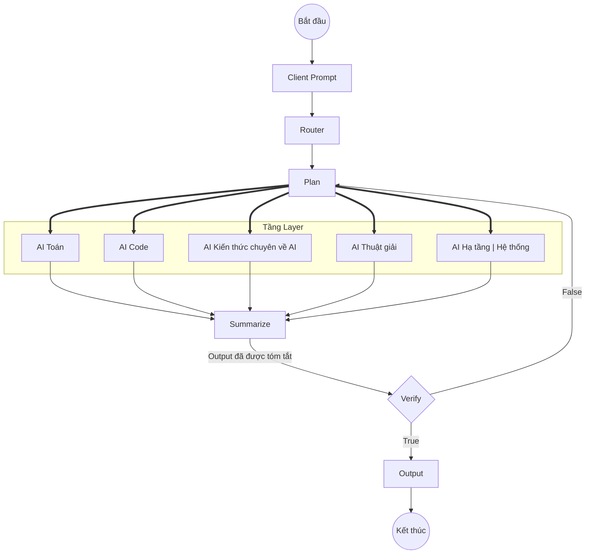

# Tổng quan về Project

## Agentic AI là gì?

Agentic AI là một hệ thống, bao gồm các Agent AI hoạt động với nhau (Agentic AI giống như một nhà máy, với mỗi module là một cơ sở vật chất, quy trình sản xuất, thì các Agent đóng vai trò giống như các công nhân (workers) làm việc trong đó).

Mình sẽ xây dựng một hệ thống Agentic AI liên quan đến tất tần tật về ngành **Khoa học dữ liệu** cho sinh viên ở UTH.

## Workflow dự kiến của Agentic AI



## Các thành phần trong Agentic AI

- **AI Plan**: Agent này có chức năng lập ra chiến lược, lập lịch nhằm điều phối, phân công các Agent AI khác thực hiện nhiệm vụ.

- **AI Router**: Agent này có chức năng giống như, định hướng cho các AI con ở tầng Layer nào sẽ thực hiện tác vụ từ yêu cầu, prompt của Client. AI Router sẽ có 4 nhiệm vụ chính như sau:

    - **Phân tích ý định**: AI Router sẽ phân tích xem yêu cầu từ client đó muốn thực hiện cái gì (Ví dụ như sinh viên đó muốn implement thuật toán Euclid, hay hỏi khái niệm Eigenvalue,...). 
    
        Nếu những yêu cầu ngoài lề (Như nói chuyện phiếm về cuộc sống thường ngày, hỏi những domain khác như Logistics không liên quan,...) $\rightarrow$ Yêu cầu của bạn không thuộc lĩnh vực của tôi.

    - **Trích xuất thực thể**: Bóc tách các keywords quan trọng từ prompt của client, ví dụ như bóc tách ra các từ như: Python, pandas $\rightarrow$ Chuyển tác vụ sang cho **AI chuyên về Code** thực hiện.

    - **Định tuyến**: Xác định xem yêu cầu của prompt này liên quan đến các tác vụ của AI nào tương ứng với chúng.
    
        <u>**Ví dụ**</u>: Client muốn hỏi khái niệm **Jacobi** và cách để implement bằng **Python**. Hai tác vụ này vừa liên quan đến Toán và Code nên Router sẽ định tuyến yêu cầu của client này để cho hai con AI chuyên Toán và Code thực hiện.

        Nếu như yêu cầu của client có nhiều Domain quá, thì đẩy thẳng qua bên **Plan** thực hiện.

    - **Chuẩn hóa dữ liệu**: Chuẩn hóa dữ liệu ở đây không chỉ là tiền xử lý dữ liệu cho sạch, mà còn là thiết kế một bộ chuẩn để các bên bộ phận khác như FE, BE còn có thể sử dụng được.
    
- **Tầng Layer**: Các Agent AI trong đây đóng vai trò công nhân chính, chúng chuyên thực hiện các tác vụ đặc thù liên quan đến domain của mình (Ví dụ client hỏi về Toán thì AI Toán sẽ thực hiện,...)

- **Summarize**: Sau khi tầng layer thực hiện xong, thông tin từ các Agent AI sẽ được gửi về Summarize. Chúng có nhiệm vụ tóm tắt, tổng hợp các thông tin này thành một Output hoàn chỉnh.

- **Verify**: AI này có nhiệm vụ đọc Output từ Summarize và xác nhận xem chúng có chính xác không? Nếu chúng đúng, thì sẽ trả về Output cho client. Ngược lại, trong trường hợp thông tin bị sai, bị Hallucination, bên Plan sẽ tiến hành đưa ra chiến lược khác nhằm cải thiện độ chính xác cho Output.

## Các tầng dữ liệu

```plaintext
+-------------------------------------------------------------------------------------------------------+
|                                          LEVEL 1: TỔNG QUAN                                           |
|                                  (Thông tin tổng quan về ngành KHDL)                                  |
+-------------------------------------------------------------------------------------------------------+
                                                       |
                                                       | 
                                                       v
+-------------------------------------------------------------------------------------------------------+
|                                      LEVEL 2: ĐỀ CƯƠNG HỌC PHẦN                                       |
|   (Thông tin về toàn bộ các đề cương học phần chi tiết trong chương trình đào tạo ngành KHDL ở UTH)   |
+-------------------------------------------------------------------------------------------------------+
                                                       |
                                                       | 
                                                       v
+-------------------------------------------------------------------------------------------------------+
|                                           L3: GIÁO TRÌNH                                              |
|                                (Giáo trình chính của từng học phần)                                   |
+-------------------------------------------------------------------------------------------------------+
```

## Techstack sử dụng dự kiến

- **Ngôn ngữ lập trình**: Python
- **Cơ sở dữ liệu**: Neo4j, QDrant, MongoDB
- **Container**: Docker
