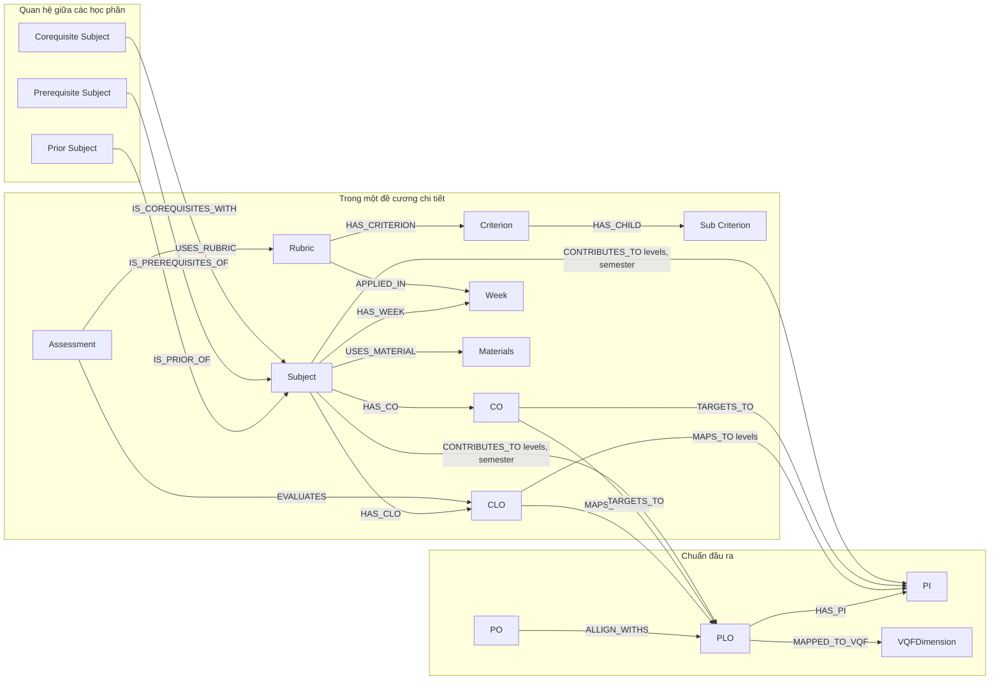

# Chuẩn hóa đề cương học phần

**Yêu cầu chính cần thực hiện**:

- [x] Thiết kế schema JSON trong ĐCHP (Đã xây dựng chuẩn đầu ra, đề cương chi tiết, rubric_catalog, chunking và metadata MinIO).
- [x] Biểu diễn mối quan hệ giữa các thành phấn chính trong ĐCCT, Chuẩn đầu ra

**Nội dung trình bày**:

1. Chuẩn học ĐCCT + Khung chương trình Chuẩn đầu ra
    
    - Thiết kế schema các collections chính
    - Trình bày ví dụ mẫu với mỗi collections
    - Thiết kế các chunks mẫu
    - Trình bày index gợi ý với mỗi collections

2. Thiết lập đồ thị biểu diễn quan hệ giữa các Nodes trong ĐCCT + Khung chương trình

    - Các khóa chính cần thiết để thiết lập Nodes trong **Neo4j**
    - Trình bày các **Cypher Pattern** biểu diễn quan hệ các **Nodes**.
    - Trình bày mẫu truy vấn trong Neo4j
    - Diagram tổng quan giữa quan hệ các Nodes.

## Chuẩn hóa đề cương học phần

### Collections chính

- `asset_files`: Collection gồm những metadata file khi up lên một hệ thống lưu trữ nào đó (`MinIO`) 
- `syllabus_subjects`: Collection lưu trữ những thông tin chung về học phần này (số tín chỉ,học phần gì,...)
- `chunk_sources`: Collection phân rã chi tiết ĐCCT (Cho Qdrant).
- `outcome_frameworks`: Collection đầu ra của CTĐT
- `rubric_catalog`: Collection rubric_catalog

### Schema

**1.** `outcome_frameworks`:

#### Quy tắc nghiệp vụ

- `po_plo_matrix`: Mỗi Object trong **Ma trận tích hợp chuẩn đầu ra và mục tiêu chương trình đào tạo** là phần tử ứng với PO và PLO.
- `plo_vqf_matrix`: Mỗi object trong **Ma trận tích hợp chuẩn đầu ra và Khung trình độ quốc gia Việt Nam (VQF)** là phần tử có giá trị phụ thuộc vào `vqf_category`: 
    - **KT**: `knowledge`
    - **KN**: `skill`
    - **TCTN**: `autonomy_and_responsibility`
- `course_contribution_plo_matrix`: Mỗi object trong **Ma trận mức độ đóng góp của học phần vào chuẩn đầu ra chương trình** là phần tử có giá trị $\in$ `contribution_level`, với `contribution_level` $\in$ ['I', 'A', 'M', 'R']:

#### Khung **JSON** mẫu, đầy đủ cho collection `outcome_frameworks`

```json
{
  "_id": "<_id của MongoDB>",
  "framework_id": "khdl-program-2024",
  "framework_version": "2024",
  "tenant_id": "default",
  "program_code": "7480201",
  "program_name": "Cử nhân Khoa học dữ liệu",
  "status": "alive",
  "source_asset_id": "DEFAULT-KHDL-PROGRAM-2024-OUTCOME_RUBRIC_PDF",
  "effective_from": "2024-01-01",
  "pos": [
    {
      "po_id": "PO1",
      "description": "Có kiến thức cơ bản về toán học, khoa học tự nhiên, kinh tế, hỗ trợ cho việc tiếp thu các kiến thức chuyên môn và kỹ năng nghề nghiệp."
    },
    {
      "po_id": "PO2",
      "description": "Có kiến thức cơ bản về khoa học chính trị và pháp luật, khoa học xã hội phù hợp với chuyên môn được đào tạo."
    },
    {
      "po_id": "PO3",
      "description": "Có các kiến thức về cơ sở kỹ thuật và ngành, có khả năng vận dụng công nghệ thông tin nhằm phát hiện các tri thức mới hỗ trợ ra quyết định tại tổ chức, doanh nghiệp."
    },
    {
      "po_id": "PO4",
      "description": "Có các kỹ năng cá nhân cần thiết, phù hợp nhiều vị trí việc làm trong môi trường làm việc liên ngành, đa văn hóa."
    },
    {
      "po_id": "PO5",
      "description": "Có các kỹ năng cá nhân cần thiết, phù hợp nhiều vị trí việc làm trong môi trường làm việc liên ngành, đa văn hóa."
    },
    {
      "po_id": "PO6",
      "description": "Có khả năng chủ động cho tương lai và ý thức tự nâng cao trình độ, học tập cả đời"
    }
  ],
  "plos": [
    {
      "plo_id": "PLO1",
      "description": "Áp dụng kiến thức toán, khoa học tự nhiên vào chuyên ngành KHDL",
      "has_pis": false
    },
    {
      "plo_id": "PLO2",
      "description": "Vận dụng các bài toán kỹ thuật chuyên môn phức tạp liên quan đến KHDL trong môi trường làm việc chuyên nghiệp đa văn hóa, đa quốc gia.",
      "has_pis": true
    },
    {
      "plo_id": "PLO3",
      "description": "Xây dựng quy trình quản lý, điều hành chuyên môn",
      "has_pis": true
    },
    {
      "plo_id": "PLO4",
      "description": "Vận dụng các kiến thức đương đại liên quan khoa học chính trị và pháp luật, khoa học xã hội phù hợp với chuyên môn được đào tạo vào hoạt động chuyên môn nhằm ra quyết định đúng đắn trong bối cảnh thay đổi.",
      "has_pis": false
    },
    {
      "plo_id": "PLO5",
      "description": "Triển khai một quy trình hoạt động trong lĩnh vực KHDL nhằm đáp ứng yêu cầu, thực hiện một nhiệm vụ cụ thể cho bài toán thực tế",
      "has_pis": false
    },
    {
      "plo_id": "PLO6",
      "description": "Đánh giá các giải pháp, chiến lược mới, các quy trình kỹ thuật, phát triển phần mềm, hệ thống CNTT đổi mới, công nghệ mới, cơ sở hạ tầng và dịch vụ.",
      "has_pis": true
    },
    {
      "plo_id": "PLO7",
      "description": "Nhận thức về giới hạn khả năng của bản thân, và sự cần thiết của việc tự đào tạo, tự học suốt đời",
      "has_pis": true
    }
  ],
  "pis": [
    {
      "pi_id": "PI2.1",
      "plo_id": "PLO2",
      "description": "Giải quyết các bài toán kỹ thuật nhiều thông số ràng buộc đầu vào thuộc chuyên ngành KHDL bằng phương pháp cụ thể"
    },
    {
      "pi_id": "PI2.2",
      "plo_id": "PLO2",
      "description": "Đánh giá các giải pháp khả thi và lựa chọn giải pháp tối ưu cho từng bài toán kỹ thuật chuyên ngành KHDL cụ thể"
    },
    {
      "pi_id": "PI2.3",
      "plo_id": "PLO2",
      "description": "Phân tích bối cảnh nghề nghiệp trong các tổ chức quốc tế"
    },
    {
      "pi_id": "PI2.4",
      "plo_id": "PLO2",
      "description": "Sử dụng tiếng Anh vào nghiên cứu tài liệu kỹ thuật ngành KHDL, đáp ứng trình độ năng lực tối thiểu bậc 3/6 theo Khung năng lực ngoại ngữ 6 bậc dùng cho Việt Nam hoặc tương đương; ứng dụng công nghệ thông tin cơ bản vào công việc theo yêu cầu."
    },
    {
      "pi_id": "PI3.1",
      "plo_id": "PLO3",
      "description": "Sử dụng công nghệ tiên tiến trong quản lý hoạt động chuyên môn"
    },
    {
      "pi_id": "PI3.2",
      "plo_id": "PLO3",
      "description": "Xây dựng quy trình hoạt động nhóm có đặc tính hiệu quả, chuyên nghiệp, chủ động, công bằng, tin tưởng tùy theo yêu cầu tình huống cụ thể"
    },
    {
      "pi_id": "PI3.3",
      "plo_id": "PLO3",
      "description": "Lập kế hoạch xây dựng một dự án khởi nghiệp"
    },
    {
      "pi_id": "PI6.1",
      "plo_id": "PLO6",
      "description": "Thiết kế sản phẩm theo yêu cầu cụ thể trong lĩnh vực KHDL"
    },
    {
      "pi_id": "PI6.2",
      "plo_id": "PLO6",
      "description": "Đánh giá mức độ hiệu quả giải pháp khoa học dựa trên nguyên tắc pháp lý, đạo đức, và trách nhiệm nghề nghiệp"
    },
    {
      "pi_id": "PI6.3",
      "plo_id": "PLO6",
      "description": "Xây dựng nội dung thuyết trình và bảo vệ quan điểm"
    },
    {
      "pi_id": "PI7.1",
      "plo_id": "PLO7",
      "description": "Thảo luận chủ động đóng góp xây dựng nội dung bài học"
    },
    {
      "pi_id": "PI7.2",
      "plo_id": "PLO7",
      "description": "Tham gia tích cực hoạt động nhóm theo hình thức được quy định"
    }
  ],
  "po_plo_matrix": [
    {
      "po_id": "PO1",
      "plo_id": "PLO1",
      "linked": true
    },
    {
      "po_id": "PO2",
      "plo_id": "PLO4",
      "linked": true
    },
    {
      "po_id": "PO3",
      "plo_id": "PLO1",
      "linked": true
    },
    {
      "po_id": "PO4",
      "plo_id": "PLO2",
      "linked": true
    },
    {
      "po_id": "PO4",
      "plo_id": "PLO3",
      "linked": true
    },
    {
      "po_id": "PO4",
      "plo_id": "PLO4",
      "linked": true
    },
    {
      "po_id": "PO4",
      "plo_id": "PLO5",
      "linked": true
    },
    {
      "po_id": "PO4",
      "plo_id": "PLO6",
      "linked": true
    },
    {
      "po_id": "PO4",
      "plo_id": "PLO7",
      "linked": true
    },
    {
      "po_id": "PO5",
      "plo_id": "PLO4",
      "linked": true
    },
    {
      "po_id": "PO5",
      "plo_id": "PLO6",
      "linked": true
    },
    {
      "po_id": "PO6",
      "plo_id": "PLO7",
      "linked": true
    }
  ],
  "plo_vqf_matrix": [
    {
      "plo_id": "PLO1",
      "vqf_dimension": "KT1",
      "vqf_category": "knowledge",
      "linked": true
    },
    {
      "plo_id": "PLO1",
      "vqf_dimension": "TTCN1",
      "vqf_category": "autonomy_responsibility",
      "linked": true
    },...
  ],
  "subject_pi_contrib": [
    {
      "subject_code": "001212",
      "subject_name": "Xác suất thống kê",
      "semester": 1,
      "target_id": "PLO1",
      "target_type": "plo",
      "contribution_levels": [
        "I"
      ],
      "is_credit_bearing": true
    },
    {
      "subject_code": "001212",
      "subject_name": "Xác suất thống kê",
      "semester": 1,
      "target_id": "PI7.1",
      "target_type": "pi",
      "contribution_levels": [
        "I"
      ],
      "is_credit_bearing": true
    },
    {
      "subject_code": "122102",
      "subject_name": "Nhập môn ngành khoa học dữ liệu",
      "semester": 1,
      "target_id": "PI2.1",
      "target_type": "pi",
      "contribution_levels": [
        "I"
      ],
      "is_credit_bearing": true
    },
   ...
  ]
}
```

#### Giải thích chi tiết các field cấp root

| Field | Kiểu dữ liệu | Mô tả |
|---|---|---|
| _id | ObjectId/String | Khóa chính của document trong MongoDB. |
| framework_id | String | Mã định danh của khung chuẩn đầu ra. |
| framework_version | String | Phiên bản của khung chuẩn đầu ra. |
| tenant_id | String | Tenant ID. |
| program_code | String | Mã chương trình đào tạo (ví dụ: `7480201`). |
| program_name | String | Tên chương trình đào tạo. |
| status | Enum(String) | Trạng thái hiệu lực của khung, ví dụ: `alive`, `deprecated`. |
| source_asset_id | String | ID file nguồn dùng để trích xuất khung chuẩn đầu ra. |
| effective_from | Date/String | Ngày bắt đầu có hiệu lực của khung. |
| pos | Array<Object> | Danh sách mục tiêu chương trình (PO), mỗi phần tử gồm `{po_id, description}`. |
| plos | Array<Object> | Danh sách chuẩn đầu ra chương trình (PLO), mỗi phần tử gồm `{plo_id, description, has_pis}`. |
| pis | Array<Object> | Danh sách chỉ báo PI, mỗi phần tử gồm `{pi_id, plo_id, description}` để gắn PI về PLO tương ứng. |
| po_plo_matrix | Array<Object> | Ma trận liên kết PO với PLO, mỗi phần tử gồm `{po_id, plo_id, linked}`. |
| plo_vqf_matrix | Array<Object> | Ma trận ánh xạ PLO với VQF, mỗi phần tử gồm `{plo_id, vqf_dimension, vqf_category, linked}`. |
| subject_pi_contrib | Array<Object> | Ma trận mức độ đóng góp học phần vào PLO/PI, mỗi phần tử gồm `{subject_code, subject_name, semester, target_id, target_type, contribution_levels, is_credit_bearing}`. |


#### Giải thích các field phụ

- `pos[]`

| Field | Kiểu dữ liệu | Mô tả |
|---|---|---|
| po_id | String | Mã mục tiêu chương trình (PO). |
| description | String | Mô tả chi tiết nội dung mục tiêu chương trình. |

- `plos[]`

| Field | Kiểu dữ liệu | Mô tả |
|---|---|---|
| plo_id | String | Mã chuẩn đầu ra chương trình (PLO). |
| description | String | Mô tả chi tiết chuẩn đầu ra chương trình. |
| has_pis | Boolean | PLO này có tách các PI con hay không. |

- `pis[]`

| Field | Kiểu dữ liệu | Mô tả |
|---|---|---|
| pi_id | String | Mã PI. |
| plo_id | String | Mã PLO tương ứng. |
| description | String | Mô tả chi tiết PI. |

- `po_plo_matrix[]`

| Field | Kiểu dữ liệu | Mô tả |
|---|---|---|
| po_id | String | Mã PO tham gia liên kết. |
| plo_id | String | Mã PLO được liên kết với PO tương ứng. |
| linked | Boolean | Trạng thái liên kết giữa PO và PLO. |

- `plo_vqf_matrix[]`

| Field | Kiểu dữ liệu | Mô tả |
|---|---|---|
| plo_id | String | Mã PLO được ánh xạ. |
| vqf_dimension | String | Mã thành phần VQF (ví dụ: KT1, KN3, TCTN2). |
| vqf_category | Enum(String) | Nhóm VQF tương ứng: `knowledge`, `skill`, `autonomy_and_responsibility`. |
| linked | Boolean | Trạng thái liên kết giữa PLO và VQF. |

- `subject_pi_contrib[]`

| Field | Kiểu dữ liệu | Mô tả |
|---|---|---|
| subject_code | String | Mã học phần đóng góp. |
| subject_name | String | Tên học phần đóng góp. |
| semester | Number (int) | Học kỳ học phần được triển khai. |
| target_id | String | Mã đích được học phần đóng góp, có thể là PLO hoặc PI. |
| target_type | String | Loại đích: `plo` hoặc `pi`. |
| contribution_levels | Array<String> | Mức độ đóng góp, tập giá trị thường dùng: `I`, `A`, `M`, `R`. |
| is_credit_bearing | Boolean | Học phần này có mang tính tích lũy trong ĐCCT không. |

---

**2.** `rubric_catalog`:

#### Quy tắc nghiệp vụ
- `rubric_variant`: Biến thể của rubric (Dùng khi đánh giá cá nhân hoặc nhóm như trong trường hợp của Rubric **A5.1** (File rubric)). Có thể là `group` | `individual` | `null`.
- Nếu `rubric_source` là **syllabus** thì `source_subject_code` bắt buộc phải có mã học phần tương ứng với rubric đó, còn không có thì `null`.
- `applies_to` áp dụng với một số thang đánh giá Rubric có yêu cầu một số điều kiện nhất định. Có thể để `{}` nếu không có.
- `evaluation_target`: `individual` | `group` | `individual_in_group` | `peer` (`peer` dùng trong người học đánh giá người học).
- `score_scale` là thang hay chuẩn nào đó để xếp loại: `1-5` | `A-F` | `excellent-poor`.
- `sub_criteria`: Các tiêu chí phụ trong thang Rubric. Nếu không có, để `[]`


#### **JSON** mẫu Rubric A5.1 (Đánh giá Tiểu luận/Đồ án/BTL < 50% - Biến thể cá nhân) - **Nguồn**: `PLO-CLO-Rubric.PDF`

```json
{
  "_id": "<_id MongoDB>",
  "tenant_id": "default",
  "rubric_source": "rubric",
  "source_subject_code": null,
  "source_asset_id": "DEFAULT-KHDL-PROGRAM-2024-OUTCOME_RUBRIC_PDF",
  "rubric_id": "A5.1",
  "rubric_variant": "individual",
  "rubric_name": "Đánh giá Tiểu luận/Đồ án/Bài tập lớn",
  "rubric_version": 2024,
  "effective_from": "2024-01-01",
  "status": "active",
  "applies_to": {
    "condition_description": "Đánh giá Tiểu luận/ Đồ án/ Bài tập lớn: <50% tổng điểm môn (dùng cho các môn I hoặc R khi người học đạt ở cấp độ học để cải thiện thêm năng lực/ hoặc làm theo cá nhân/ giảng viên đánh giá người học",
    "max_bloom_level": 3,
    "threshold_operator": "lt",
    "total_weight_threshold": 50,
    "course_type_refs": [
      "I",
      "R"
    ],
    "subject_code_refs": []
  },
  "assessment_group": "project",
  "assessment_guidelines": [
    "Chủ yếu cho người học làm quen với việc tự học, thực hiện công việc theo quy định bloom cấp độ 3 trở xuống"
  ],
  "evaluation_target": "individual",
  "score_scale": "1-5",
  "score_levels": [
    {
      "level_code": 1,
      "level_grading": "1",
      "level_range": {
        "min": 8.5,
        "max": 10
      },
      "ordinal": 0
    },
    {
      "level_code": 2,
      "level_grading": "2",
      "level_range": {
        "min": 7,
        "max": 8.4
      },
      "ordinal": 1
    },
    {
      "level_code": 3,
      "level_grading": "3",
      "level_range": {
        "min": 5.5,
        "max": 6.9
      },
      "ordinal": 2
    },
    {
      "level_code": 4,
      "level_grading": "4",
      "level_range": {
        "min": 4,
        "max": 5.4
      },
      "ordinal": 3
    },
    {
      "level_code": 5,
      "level_grading": "5",
      "level_range": {
        "min": 0,
        "max": 3.9
      },
      "ordinal": 4
    }
  ],
  "criteria": [
    {
      "criterion_code": "NOI_DUNG_BAI_NOP",
      "criterion_name": "Chất lượng nội dung bài nộp",
      "weight_percent": 40,
      "level_descriptors": [],
      "sub_criteria": [
        {
          "criterion_code": "LOI_THUAT_NGU",
          "criterion_name": "Lỗi thuật ngữ",
          "weight_percent": 10,
          "level_descriptors": [
            {
              "level_code": 1,
              "description": "Tối thiểu 1 lỗi"
            },
            {
              "level_code": 2,
              "description": "Tối thiểu 2 lỗi"
            },
            {
              "level_code": 3,
              "description": "Tối thiểu 3 lỗi"
            },
            {
              "level_code": 4,
              "description": "Tối thiểu 4 lỗi"
            },
            {
              "level_code": 5,
              "description": "Tối thiểu 5 lỗi"
            }
          ]
        },
        {
          "criterion_code": "LAP_LUAN",
          "criterion_name": "Lập luận",
          "weight_percent": 30,
          "level_descriptors": [
            {
              "level_code": 1,
              "description": "Hoàn toàn chặt chẽ, logic"
            },
            {
              "level_code": 2,
              "description": "Khá chặt chẽ, logic; còn sai sót nhỏ"
            },
            {
              "level_code": 3,
              "description": "Tương đối chặt chẽ, logic, có sai sót quan trọng"
            },
            {
              "level_code": 4,
              "description": "Tương đối chặt chẽ, logic, có sai sót quan trọng"
            },
            {
              "level_code": 5,
              "description": "Không chặt chẽ, không logic"
            }
          ]
        }
      ],
      "is_required": true
    },
    {
      "criterion_code": "HINH_THUC_BAI_NOP",
      "criterion_name": "Chất lượng hình thức bài nộp",
      "weight_percent": 30,
      "level_descriptors": [
        {
          "level_code": 1,
          "description": "Đúng tất cả yêu cầu"
        },
        {
          "level_code": 5,
          "description": "Không đúng yêu cầu"
        }
      ],
      "sub_criteria": [],
      "is_required": true
    },
    {
      "criterion_code": "THUYET_TRINH",
      "criterion_name": "Thuyết trình",
      "weight_percent": 30,
      "sub_crtierias": [],
      "level_descriptors": [
        {
          "level_code": 1,
          "description": "Đúng tất cả tiêu chí đánh giá"
        },
        {
          "level_code": 2,
          "description": "Đúng 4 tiêu chí"
        },
        {
          "level_code": 3,
          "description": "Đúng 3 tiêu chí"
        },
        {
          "level_code": 4,
          "description": "Đúng 2 tiêu chí"
        },
        {
          "level_code": 5,
          "description": "Đúng tối đa 1 tiêu chí"
        }
      ],
      "is_required": true
    }
  ]
}
```

#### **JSON** mẫu Rubric A1.3 (Kiểm tra giữa kỳ) - **Nguồn:** `Học phần OOP`

- Tương tự mẫu trên, nhưng thay thế `rubric_source = "syllabus"` và bổ sung thêm mã HP tương ứng.

```json
{
  "_id": {
    "$oid": "6a02ae7effce10993e8c7f6b"
  },
  "rubric_id": "A1.3",
  "rubric_name": "Kiểm tra giữa kỳ",
  "rubric_variant": null,
  "tenant_id": "default",
  "rubric_version": "2024",
  "rubric_source": "syllabus",
  "assessment_group": "mid_final_exam",
  "evaluation_target": "individual",
  "score_scale": "A-F",
  "source_subject_code": "122003",
  "status": "alive",
  "effective_from": "2024-01-01",
  "source_asset_id": "DEFAULT-122003-SYLLABUS_PDF",
  "score_levels": [
    {
      "level_code": 1,
      "level_grading": "A",
      "level_range": {
        "min": 8.5,
        "max": 10
      },
      "ordinal": 0
    },
    {
      "level_code": 2,
      "level_grading": "B",
      "level_range": {
        "min": 7,
        "max": 8.4
      },
      "ordinal": 1
    },
    {
      "level_code": 3,
      "level_grading": "C",
      "level_range": {
        "min": 5.5,
        "max": 6.9
      },
      "ordinal": 2
    },
    {
      "level_code": 4,
      "level_grading": "D",
      "level_range": {
        "min": 4,
        "max": 5.4
      },
      "ordinal": 3
    },
    {
      "level_code": 5,
      "level_grading": "F",
      "level_range": {
        "min": 0,
        "max": 3.9
      },
      "ordinal": 4
    }
  ],
  "criteria": [
    {
      "criterion_code": "BAI_TOAN_LAP_TRINH",
      "criterion_name": "Giải quyết bài toán bằng lập trình",
      "weight_percent": 50,
      "level_descriptors": [
        {
          "level_code": 1,
          "description": "Hoàn thành đúng 85% yêu cầu trở lên"
        },
        {
          "level_code": 2,
          "description": "Hoàn thành đúng từ 70-84% yêu cầu trở lên"
        },
        {
          "level_code": 3,
          "description": "Hoàn thành đúng từ 55-69% yêu cầu trở lên"
        },
        {
          "level_code": 4,
          "description": "Hoàn thành đúng từ 40-54% yêu cầu trở lên"
        },
        {
          "level_code": 5,
          "description": "Hoàn thành đúng dưới 39% yêu cầu"
        }
      ],
      "sub_criteria": [],
      "is_required": true
    },
    {
      "criterion_code": "CAU_HOI_TRAC_NGHIEM",
      "criterion_name": "Trả lời đúng câu hỏi trắc nghiệm",
      "weight_percent": 50,
      "level_descriptors": [
        {
          "level_code": 1,
          "description": "Hoàn thành đúng 85% yêu cầu trở lên"
        },
        {
          "level_code": 2,
          "description": "Hoàn thành đúng từ 70-84% yêu cầu trở lên"
        },
        {
          "level_code": 3,
          "description": "Hoàn thành đúng từ 55-69% yêu cầu trở lên"
        },
        {
          "level_code": 4,
          "description": "Hoàn thành đúng từ 40-54% yêu cầu trở lên"
        },
        {
          "level_code": 5,
          "description": "Hoàn thành đúng dưới 39% yêu cầu"
        }
      ],
      "sub_criteria": [],
      "is_required": true
    }
  ]
}
```

#### Giải thích chi tiết các field cấp gốc trong `rubric_catalog`

| Field | Kiểu dữ liệu | Mô tả |
| --- | --- | --- |
| _id | ObjectId | Khóa mặc định trong MongoDB. |
| tenant_id | String | Mã tenant sở hữu dữ liệu rubric, dùng để phân tách dữ liệu đa tenant. |
| rubric_source | Enum(String) | Nguồn tạo rubric, `rubric` \| `syllabus`. |
| source_subject_code | String \| null | Mã học phần nguồn. Bắt buộc có giá trị khi `rubric_source = syllabus`, mặc định `null`. |
| source_asset_id | String | ID file nguồn (PDF/asset), tham chiếu từ `asset_files`. |
| rubric_id | String | Mã rubric nghiệp vụ (ví dụ: A5.1). |
| rubric_variant | Enum(String) hoặc null | Biến thể rubric theo ngữ cảnh đánh giá, ví dụ: `individual`, `group` hoặc null. |
| rubric_name | String | Tên của thang rubric. |
| rubric_version | Number \| String | Phiên bản rubric, thường theo năm ban hành hoặc năm cập nhật. |
| effective_from | Date/String | Ngày bắt đầu có hiệu lực của rubric. |
| status | Enum(String) | Trạng thái hiệu lực dữ liệu rubric, ví dụ: `alive`, `active` hoặc `deprecated`. |
| applies_to | Object \| null | Thông tin điều kiện áp dụng rubric, có thể để `{}` nếu không có. |
| assessment_group | Enum(String) | Loại hình đánh giá mà rubric áp dụng, ví dụ: `project`, `attendance`, `presentation`, `mandatory_assignment`, `laboratory`, `mid_final_exam`, `peer` |
| assessment_guidelines | Array\<String\> | Hướng dẫn phạm vi sử dụng rubric trong hoạt động đánh giá. |
| evaluation_target | Enum(String) | Đối tượng được đánh giá trong thang Rubric: `individual`, `group`, hoặc `individual_in_group`, `peer`. |
| score_scale | Enum(String) | Chuẩn thang chấm điểm, ví dụ: `1-5`, `A-F`, `excellent-poor`. |
| score_levels | Array\<Object\> | Danh sách các mức điểm thuộc thang chấm. Chi tiết xem ở `score_levels[]`. |
| criteria | Array\<Object\> | Danh sách tiêu chí chấm điểm cấp gốc của rubric. Chi tiết xem ở `criteria[]`. |

#### Giải thích các field phụ

- `score_levels[]`

Định nghĩa thang điểm được dùng để đánh giá trong **Rubric**.

| Field | Kiểu dữ liệu | Mô tả |
|---|---|---|
| level_code | int | Mã của mức điểm đó, dùng để tham chiếu tới mức của tiêu chí. |
| level_grading | string | Giá trị của mức điểm (giá trị dựa theo `score_scale`). |
| level_range | Object | Khoảng điểm để đạt được mức điểm đó, thường có dạng `{min, max}`. |
| ordinal | int | Dùng để sắp xếp thứ tự bậc cao $\rightarrow$ bậc thấp của mức điểm tương ứng. |

- `criteria[]`

|Field| Kiểu dữ liệu | Mô tả |
|---|---|---|
| is_required | boolean | Tiêu chí bắt buộc |
| criterion_code | String | Mã tiêu chí |
| criterion_name | String | Tên tiêu chí |
| weight_percent| int | Trọng số của tiêu chí chiếm bao nhiêu so với rubric tổng | 
| level_descriptors | Array\<Object\> \| `[]` | Chi tiết các mức đánh giá của tiêu chí đó, theo từng level `{"level_code", "description"}` |
| sub_criteria | Array\<Object\> \| `[]` | Các tiêu chí phụ, cấu trúc của `sub_criteria[]` tương tự `criteria[]`, nếu không có thì để `[]`. |
---

**3.** `asset_files`:

#### Nghiệp vụ chính

- Dùng để lưu trữ metadata với file được upload lên MinIO
- `kind`: Dùng để phân loại sau này file đó là gì: `syllabus_pdf`, `outcome_rubric_pdf`...
- Template `asset_id`: `{tenant_id}-{subject_code/framework_code}-{kind}`

#### Ví dụ **JSON** 

```json
{
  "_id": "<_id MongoDB>",
  "asset_id": "DEFAULT-127100-SYLLABUS_PDF",
  "tenant_id": "default",
  "subject_code": "127100",
  "storage_provider": "minio",
  "bucket": "bronze",
  "object_key": "bronze/default/syllabus_pdf/10_127100 - Phan tich du lieu dinh tinh va dinh luong(2024).pdf",
  "original_filename": "10_127100 - Phan tich du lieu dinh tinh va dinh luong(2024).pdf",
  "content_type": "application/pdf",
  "kind": "syllabus_pdf",
  "file_type": "syllabus",
  "size": 380167,
  "sha256": "ab64f8353478a5f09c25766cbdce5fc4cdaf7cc6d184a0956863cea1bbcb9088"
}
```

#### Giải thích chi tiết field trong collection


| Trường | Kiểu | Mô tả |
| --- | --- | --- |
| _id | ObjectId / String | Khóa MongoDB. |
| subject_code | String | Mã học phần. |
| original_file_name | String | Tên file gốc khi người dùng tải lên. |
| storage_provider | String | Dịch vụ lưu trữ được sử dụng, ví dụ: `minio`. |
| content_type | String | Kiểu nội dung theo MIME type, ví dụ: `application/pdf`. |
| size | Number | Kích thước file gốc tính theo byte. |
| uploaded_at | Date / String | Thời điểm file được tải lên hệ thống lưu trữ. |
| kind | String | Nhóm phân loại của file, ví dụ: syllabus_pdf. |
| object_key | String | File path trong MinIO. |
| source_asset_id | String | ID của file gốc |
| tenant_id | String | Mã tenant sở hữu dữ liệu, thường là `default`. |
| hashing | String | Giá trị hash của file để kiểm tra toàn vẹn dữ liệu, ví dụ: `sha256`. |


- `syllabus_subjects`:

#### Nghiệp vụ chính

- Các domain của `agent` bao gồm: `[foundation-math, advanced-ai, coding-algo, system-infra, database-decentr]` (Toán nền tảng - AI nâng cao - Code và thuật giải - Hệ thống và Hạ tầng - CSDL và Hệ thống phi tập trung).
- Nhúng liên kết `CO -> PO/PLO(PI)` trực tiếp trong từng phần tử `cos[]` qua field `outcome_links[]`.
- Quy tắc ưu tiên link CO: nếu có PI thì map vào `target_type = pi`; chỉ map trực tiếp `target_type = plo` khi PLO đó chưa tách PI hoặc cần giữ liên kết nghiệp vụ ở mức PLO.
- `course_type`: Đây là học phần gì (`mandatory, required_elective, free_elective`) (Ứng với bắt buộc - tự chọn bắt buộc - tự do bắt buộc)
- `knowledge_block`: Thuộc loại học phần nào (`generalization` hoặc `specialization`) (Ứng với **Cơ sở ngành** và **Chuyên ngành**)
- `contribution_level` Mức độ đóng góp của CLOs vào PLO. Truyền vào mảng bao gồm `[I, R, M, A]`
- Giải thích các loại học phần:
    - **Học phần học trước (`previous_courses`)**: Là học phần mà sinh viên phải đăng ký học trước đó và đã có kết quả (Không quan trọng Đạt hay Chưa đạt) trước khi học học phần tiếp theo. **Ví dụ**: Trước khi đăng ký **Cloud Computing** thì sinh viên phải học trước đó và đã có kết quả (Đạt hoặc Chưa đạt) **Computer Networking**.
    - **Học phần tiên quyết (`prerequisites`)**: Là học phần mà sinh viên đã đăng ký học trước đó và phải **ĐẠT** học phần đó trước khi đăng ký sang học phần tiếp theo. **Ví dụ**: Sinh viên đăng ký học phần **PTDLĐTĐL** phải học trước **XSTK** và có kết quả **ĐẠT** học phần **XSTK** đó.
    - **Học phần song hành (`corequisites`)**: Là những học phần mà diễn ra trong cùng một học kỳ.

#### Ví dụ **JSON**

```json
{
  "_id": "_id MongoDB",
  "subject_code": "127102",
  "subject_name": "CÁC PHƯƠNG PHÁP TOÁN CHO MÁY HỌC",
  "subject_name_en": "MATHEMATICAL METHODS FOR MACHINE LEARNING",
  "agent_domain": "foundation-math",
  "syllabus_version": "2025",
  "tenant_id": "default",
  "grading_scale": 10,
  "course_type": "required",
  "component": "specialization",
  "credits": {
    "total": 3,
    "theory": 2,
    "practice": 1
  },
  "time_allocation": {
    "theory_hours": 30,
    "practice_hours": 30,
    "total_contact_hours": 60,
    "self_study_hours": 90
  },
  "prior_courses": [
    {
      "code": "127100",
      "name": "Phân tích dữ liệu định tính và định lượng"
    }
  ],
  "prerequisites": [],
  "corequisites": [],
  "source_asset_id": "DEFAULT-127102-SYLLABUS_PDF",
  "outcome_framework_ref": {
    "framework_id": "khdl-program-2024",
    "framework_version": "2024"
  },
  "rubric_refs": [
    {
      "rubric_ref_id": "RUBRIC-A4.1-REF",
      "rubric_source": "rubric",
      "rubric_version": "2024",
      "rubric_variant": null,
      "evaluation_target": "individual",
      "assessment_group": "mid_final_exam",
      "rubric_id": "A4.1"
    },
    {
      "rubric_ref_id": "RUBRIC-A1.1-REF",
      "rubric_source": "syllabus",
      "rubric_version": "2024",
      "rubric_variant": null,
      "evaluation_target": "individual",
      "assessment_group": "attendance",
      "rubric_id": "A1.1"
    },
    {
      "rubric_ref_id": "RUBRIC-A5.3-REF",
      "rubric_source": "rubric",
      "rubric_version": "2024",
      "evaluation_target": "individual",
      "rubric_variant": null,
      "assessment_group": "project",
      "rubric_id": "A5.3"
    }
  ],
  "cos": [
    {
      "co_uid": "127102:CO1",
      "co_id": "CO1",
      "description": "Áp dụng kiến thức toán vào chuyên ngành Khoa Học Dữ Liệu",
      "plo_pi_refs": [
        "PLO1"
      ]
    },
    {
      "co_uid": "127102:CO2",
      "co_id": "CO2",
      "description": "Giải quyết các bài toán kỹ thuật nhiều thông số ràng buộc đầu vào thuộc chuyên ngành Khoa Học Dữ Liệu bằng phương pháp cụ thể; Đánh giá các giải pháp khả thi và lựa chọn giải pháp tối ưu cho từng bài toán kỹ thuật chuyên ngành Khoa Học Dữ Liệu cụ thể; Phân tích bối cảnh nghề nghiệp trong các tổ chức quốc tế",
      "plo_pi_refs": [
        "PI2.1",
        "PI2.2",
        "PI2.3"
      ]
    }
  ],
  "clos": [
    {
      "clo_uid": "127102:CLO1",
      "code_short": "CLO1",
      "description": "Áp dụng các kiến thức toán học như đại số tuyến tính, giải tích, xác suất thống kê và toán rời rạc vào việc hiểu và áp dụng các phương pháp máy học",
      "plo_pi_links": [
        {
          "target_type": "PLO",
          "target_id": "PLO1",
          "levels": [
            "R",
            "A"
          ]
        }
      ]
    },
    {
      "clo_uid": "127102:CLO2",
      "code_short": "CLO2",
      "description": "Áp dụng các công cụ phần mềm để giải quyết các vấn đề trong máy học; Phân tích và hiểu sâu hơn các khái niệm toán học liên quan đến các thuật toán máy học như xử lý dữ liệu, các mô hình phân phối, bài toán tối ưu hoá từ dữ liệu thực tế,  các phương pháp ước lượng tham số của mô hình (OLS, MLE, MAP,...); Phân tích bối cảnh nghề nghiệp và ứng dụng các phương pháp máy học vào các lĩnh vực khác nhau",
      "plo_pi_links": [
        {
          "target_type": "PI",
          "target_id": "PI2.1",
          "levels": [
            "R"
          ]
        }
      ]
    },
    {
      "clo_uid": "127102:CLO2",
      "code_short": "CLO2",
      "description": "Áp dụng các công cụ phần mềm để giải quyết các vấn đề trong máy học; Phân tích và hiểu sâu hơn các khái niệm toán học liên quan đến các thuật toán máy học như xử lý dữ liệu, các mô hình phân phối, bài toán tối ưu hoá từ dữ liệu thực tế,  các phương pháp ước lượng tham số của mô hình (OLS, MLE, MAP,...); Phân tích bối cảnh nghề nghiệp và ứng dụng các phương pháp máy học vào các lĩnh vực khác nhau",
      "plo_pi_links": [
        {
          "target_type": "PI",
          "target_id": "PI2.2",
          "levels": [
            "R"
          ]
        }
      ]
    },
    {
      "clo_uid": "127102:CLO2",
      "code_short": "CLO2",
      "description": "Áp dụng các công cụ phần mềm để giải quyết các vấn đề trong máy học; Phân tích và hiểu sâu hơn các khái niệm toán học liên quan đến các thuật toán máy học như xử lý dữ liệu, các mô hình phân phối, bài toán tối ưu hoá từ dữ liệu thực tế,  các phương pháp ước lượng tham số của mô hình (OLS, MLE, MAP,...); Phân tích bối cảnh nghề nghiệp và ứng dụng các phương pháp máy học vào các lĩnh vực khác nhau",
      "plo_pi_links": [
        {
          "target_type": "PI",
          "target_id": "PI2.3",
          "levels": [
            "R"
          ]
        }
      ]
    }
  ],
  "clo_pi_matrix": [
    {
      "clo_uid": "127102:CLO1",
      "target_type": "PLO",
      "target_id": "PLO1",
      "contribution_levels": [
        "R",
        "A"
      ]
    },
    {
      "clo_uid": "127102:CLO2",
      "target_type": "PI",
      "target_id": "PI2.1",
      "contribution_level": [
        "R"
      ]
    },
    {
      "clo_uid": "127102:CLO2",
      "target_type": "PI",
      "target_id": "PI2.2",
      "contribution_level": [
        "R"
      ]
    },
    {
      "clo_uid": "127102:CLO2",
      "target_type": "PI",
      "target_id": "PI2.3",
      "contribution_level": [
        "R"
      ]
    }
  ],
  "assessments": [
    {
      "assessment_uid": "127102-FORMATIVE-A1.1",
      "assessment_component": "formative",
      "assessment_method": "Chuyên cần",
      "clo_ref": [
        "CLO2"
      ],
      "rubric_ref_id": ["RUBRIC-A1.1-REF"],
      "weight_percent": 5,
      "assessment_criteria": ""
    },
    {
      "assessment_uid": "127102-FORMATIVE-A5.3",
      "assessment_component": "formative",
      "assessment_method": "Bài tập lớn",
      "clo_ref": [
        "CLO1",
        "CLO2"
      ],
      "rubric_ref_id": ["RUBRIC-A5.3-REF"],
      "weight_percent": 55,
      "assessment_criteria": ""
    },
    {
      "assessment_uid": "127102-SUMMATIVE-A4.1",
      "assessment_component": "summative",
      "assessment_method": "Bài thi tự luận và trắc nghiệm",
      "clo_ref": [
        "CLO1",
        "CLO2"
      ],
      "rubric_ref_id": ["RUBRIC-A4.1-REF"],
      "weight_percent": 40,
      "assessment_criteria": ""
    }
  ],
  "weeks": [
    {
      "week_uid": "W01-W02-127102",
      "week_range": "[1,2]",
      "week_label": "Tuần 1-2",
      "chapter": {
        "number": 1,
        "title": "Ma trận, định thức",
        "title_en": ""
      },
      "theory_sections": [
        {
          "section_uid": "127102-C1-1-1",
          "section_number": "1.1",
          "title": "Ma trận"
        },
        {
          "section_uid": "127102-C1-1-2",
          "section_number": "1.2",
          "title": "Định thức của ma trận vuông"
        },
        {
          "section_uid": "127102-C1-1-3",
          "section_number": "1.3",
          "title": "Hạng của ma trận"
        },
        {
          "section_uid": "127102-C1-1-4",
          "section_number": "1.4",
          "title": "Thuật toán Gauss-Jordan khảo sát và tìm ma trận nghịch đảo"
        }
      ],
      "practice_description": "Bài tập về ma trận, định thứ\nLàm quen với thư viện Numpy Python, sử dụng ngôn ngữ lập trình Python trong xử lý các bài toán ma trận.",
      "clo_links": [
        "CLO1",
        "CLO2"
      ],
      "assessment_types": [
        "A1.1",
        "A5.3"
      ],
      "teaching_methods": [
        "Thuyết giảng",
        "Cho sinh viên thảo luận nhóm"
      ],
      "activities": {
        "teacher": "Giới thiệu thông tin về Thầy, Cô\nTrình bày các vấn đề liên quan đến môn học\nLàm rõ cách thức dạy và học\nCung cấp yêu cầu về Bài tập lớn\nGiới thiệu lướt qua đề cương môn học và vị trí các đề cương được công bố\nGiảng các slide chương 1",
        "student": "Làm việc nhóm thảo luận về các nội dung của bài giảng"
      }
    },..
  ],
  "materials": [
    {
      "material_uid": "127102-MAIN-MTRL-001",
      "material_type": "main",
      "authors": [
        "Marc Peter Deisenroth"
      ],
      "title": "Mathematics for Machine Learning",
      "publisher": "Cambridge University Press",
      "published_year": 2019,
      "reference_url": ""
    },...
  ]
}
```

#### Giải thích chi tiết field ở cấp root (theo JSON mẫu `syllabus_subjects`)

| Tên field | Kiểu dữ liệu | Mô tả |
| --- | --- | --- |
| _id | ObjectID/String | Khóa mặc định của MongoDB. |
| subject_code | String | Mã học phần. |
| subject_name | String | Tên học phần tiếng Việt. |
| subject_name_en | String | Tên học phần tiếng Anh. |
| subject_topics | Array<String> | Danh sách chủ đề hoặc từ khóa của học phần. |
| rubric_refs | Array<Object> | Danh sách tham chiếu rubric trong học phần; mỗi phần tử thường gồm `rubric_ref_id, rubric_id, rubric_source, rubric_version, rubric_variant, evaluation_target, assessment_type`. |
| grading_scale | Number | Thang điểm áp dụng cho học phần (ví dụ: `10`). |
| syllabus_version | Number | Phiên bản đề cương học phần (năm cập nhật). |
| tenant_id | String | Mã tenant sở hữu dữ liệu học phần. |
| source_asset_id | String | ID file nguồn (asset) tham chiếu trong `asset_files`. |
| credits | Object | Thông tin tín chỉ: `{total_credits, theory_credit, practice_credits}`. |
| assessments | Array<Object> | Danh sách phương thức đánh giá của học phần; mỗi phần tử gồm `assessment_uid, assessment_component, clo_refs, rubric_ref_id, weight_percent, assessment_method`. |
| subject_duration | Object | Thời lượng học phần: `{theory_hours, practice_hours, total_contact_hours, self_study_hours}`. |
| outcome_framwork_ref | Object | Tham chiếu đến `outcome_frameworks`: `{program_version, program_code}` (ghi theo JSON mẫu). |
| cos | Array<Object> | Danh sách Course Objectives (CO): mỗi phần tử `{co_uid, code_short, description, outcome_links[]}`. |
| clos | Array<Object> | Danh sách Course Learning Outcomes (CLO): mỗi phần tử `{clo_uid, code_short, description}`. |
| clo_plo_matrix | Array<Object> | Ma trận ánh xạ CLO -> PLO/PI; mỗi phần tử gồm `{clo_id, target_type, target_id, levels}`. |
| agent_domain | Enum[String] | Nhãn domain cho Router AI (ví dụ `database-decentr`). |
| course_type | Enum[String] | Loại học phần: `required`, `required_elective`, `free_elective`. |
| knowledge_block | String | Nhóm kiến thức: `generalization` hoặc `specialization`. |
| previous_courses | Array<Object> | Danh sách học phần học trước: `[{subject_code, subject_name}]`. |
| prerequisites | Array<Object> | Danh sách học phần tiên quyết (phải đạt): `[]` nếu không có. |
| corequisites | Array<Object> | Danh sách học phần song hành: `[]` nếu không có. |
| weeks | Array<Object> | Lịch tuần và nội dung: mảng tuần, mỗi tuần gồm `week_uid, week_range, chapter, theory_sections, practice_descriptions, activities, teaching_method, clos_ref, assessment_methods`. |
| materials | Array<Object> | Danh sách tài liệu học tập: mỗi phần tử `{material_type, authors, published_year, title, publisher, reference_url}`. |


#### Giải thích chi tiết các field phụ

- `cos[].outcome_links[]`

| Field | Kiểu dữ liệu | Mô tả |
|---|---|---|
| target_type | Enum(String) | Loại đích của CO: `po` \| `pi` |
| target_id | String | Mã PO/PI tương ứng (ví dụ: `PO4`, `PI2.3`) |

- `rubric_refs[]`

| Field | Kiểu dữ liệu | Mô tả |
|---|---|---|
| rubric_ref_id | String | Mã tham chiếu rubric dùng trong học phần. |
| rubric_id | String | Mã rubric gốc, ví dụ: `A1.2`, `A5.2`. |
| rubric_source | Enum(String) | Nguồn rubric: `rubric` hoặc `syllabus`. |
| rubric_version | Number | Phiên bản của rubric. |
| rubric_variant | Enum(String) \| null | Biến thể của rubric, ví dụ: `individual`, `group` hoặc `null`. |
| evaluation_target | Enum(String) | Đối tượng được đánh giá: `individual`, `group`, hoặc `individual_in_group`. |
| assessment_type | String | Loại hình đánh giá, ví dụ: `attendance`, `project`, `mandatory_assignment`, `mid_final_exam`. |

- `clos[]`

| Field | Kiểu dữ liệu | Mô tả |
|---|---|---|
| clo_uid | String | Mã định danh CLO. |
| code_short | String | Mã ngắn của CLO, thường dùng trong các liên kết. |
| description | String | Mô tả chi tiết CLO. |

- `clo_plo_matrix[]`

| Field | Kiểu dữ liệu | Mô tả |
|---|---|---|
| clo_id | String | Map với `clos.code_short` của ĐCCT tương ứng. |
| target_type | Enum(String) | CLO tương ứng với PLO/PI: `plo` \| `pi`. |
| target_id | String | Mã PLO/PI tương ứng. |
| levels | Array<String\> | Level mà CLO đó đóng góp, ví dụ: `['I', 'R', 'M', 'A']`. |

- `assessments[]`:

| Field | Kiểu dữ liệu | Mô tả|
|---|---|---|
assessment_uid | String | Mã định danh của phương thức đánh giá. Theo format `<MÃ_HỌC_PHẦN>-<THÀNH_PHẦN_ĐÁNH_GIÁ>-<MÃ_RUBRIC>`. |
assessment_component|Enum(String)|Thành phần đánh giá học phần (quá trình, KTHP). `formative` \| `summative`. |
assessment_method | String | Phương pháp dùng để đánh giá học phần. |
assessment_criteria | String | Tiêu chí phụ để đánh giá phương thức đánh giá ấy (Ví dụ trong học phần: *Lập trình JS/TS*) |
clo_refs | Array<String\> | Hình thức đánh giá này tương ứng với CLO nào, ví dụ: `['CLO2']`. |
rubric_ref_id | List[str] | List các mã tham chiếu thang rubric từ `rubric_refs` trong chính document ĐCCT. |
weight_percent|int|Trọng số đánh giá của thành phần tương ứng. |

- `weeks[]`:

| Field | Kiểu dữ liệu | Mô tả |
|---|---|---|
| week_uid | String | UID theo nội dung học. |
| week_range | Array\<Number\> | Khoảng tuần áp dụng nội dung. Ví dụ: `[1,2]` nghĩa là từ tuần 1 đến tuần 2. |
| chapter | Object | Thông tin chương ở cấp tuần, gồm số chương và tiêu đề chương. `{chapter_number, chapter_title}` |
| theory_sections | Array\<Object\> | Danh sách các mục lý thuyết trong chương của tuần đó. `{section_uid, section_number, section_title}`. |
| practice_descriptions | Array\<String\> | Mô tả các hoạt động thực hành/bài tập trong tuần. |
| activities | Object | Hoạt động dạy-học theo vai trò, gồm mô tả hoạt động của giảng viên (`teacher`) và người học (`student`). |
| teaching_method | String | Phương pháp giảng dạy áp dụng cho tuần/chặng nội dung này. |
| clos_ref | Array\<String\> | Danh sách CLO được liên kết với nội dung tuần. Ví dụ: `["CLO1"]`. |
| assessment_methods | Array\<String\> | Danh sách mã phương pháp đánh giá/rubric áp dụng cho tuần. Ví dụ: `["A1.2"]`.

- `materials[]`

| Field | Kiểu dữ liệu | Mô tả |
|---|---|---|
| material_uid | String | ID định danh tài liệu. Format `<Mã HP>-Kiểu tài liệu (MAIN: chính\|REF: tham khảo)-MTRL-<Index tài liệu trong ĐCCT ấy>` |
| material_type | Enum(String) | Loại tài liệu (giáo trình chính/TLTK). `main` \| `reference` |
| authors | Array<String> | Danh sách tác giả của tài liệu. |
| published_year | Number (int) | Năm xuất bản tài liệu. |
| title | String | Tên tài liệu|
| publisher | String | Nhà xuất bản hoặc đơn vị phát hành |
| reference_url | String \| null | Liên kết tham khảo đến tài liệu số (nếu có) |

---

**5.** `chunk_sources`:

#### Quy tắc nghiệp vụ
- Ta sẽ chia nhỏ ra, băm theo các mục con của từng chương thay vì gộp lại cả chương (Ví dụ từng mục con của chương, criteria của rubric nào đó,...).
- `chunk_type`: Mỗi docs là mỗi bản băm ra thành chunk nhỏ, nên sẽ có đa dạng thể loại như: `theory_section`, `rubric_criteria`, `course_objective`, `teacher_activity`,`course_outcome`, `material`,...
- `claim_scope`: Phân lớp ra, mục đích để gán chunk đó đúng với scope tương ứng của nó. `activity`, `knowledge`, `policy`, `outcome`, `rubric`,`assessment`.
- Chunk tối thiểu cần có các payload sau: `{"tenant_id","week_uid"}`

#### Chunk **JSON** mẫu

Ví dụ chunk **JSON** mẫu nội dung học thuật - **mục con 2.1 của môn Máy học**

```json
{
  "_id": "<_id MongoDB>",
  "doc_id": "SECTION-2-1-127104-2025-W03-W05",
  "subject_code": "127104",
  "tenant_id": "default",
  "syllabus_version": "2025",
  "chunk_type": "content",
  "claim_scope": "knowledge",
  "week_uid": "W03-W05-127104",
  "section_uid": "127104-C2-2-1",
  "source_asset_id": "DEFAULT-12704-SYLLABUS_PDF",
  "source_file_name": "25_127104 - May hoc(2024).pdf",
  "clo_links": [
    "CLO1",
    "CLO2",
    "CLO3"
  ],
  "topic": "Tổng quan Supervised Learning",
  "agent_domain": "advanced-ai",
  "text": "[WEEK:W03-W05][SUBJECT:127104][CHAPTER:2][SECTION:2.1] Học có giám sát (Supervised Learning): Giới thiệu về SL",
  "hash_content": "sha256:389ac235b63fa9b8389e4a4c77313e553b7360748e46fac5e73212c9dc19e6fd"
}
```

Ví dụ chunk **JSON** mẫu mục tiêu học phần - **mục CO1 của môn Máy học**

```json
{
  "_id": "<Khóa MongoDB>",
  "doc_id": "127104-2025-CO1",
  "subject_code": "127104",
  "tenant_id": "default",
  "syllabus_version": "2025",
  "co_uid": "127104:CO1",
  "code_short": "CO1",
  "chunk_type": "course_objective",
  "source_file_name": "25_127104 - May hoc(2024).pdf",
  "claim_scope": "outcome",
  "plo_po_refs": [
    {
      "target_type": "PI",
      "target_id": "PI2.1"
    }
  ],
  "text": "[COURSE_OBJECTIVE][127104:CO1][PI:PI2.1] CO1: Giải quyết các bài toán kỹ thuật ...",
  "hash_content": "sha256:b4cf4195ed2faad22768e569630312a746652cc75b248b339f74bd2b3c12d2e5",
  "source_asset_id": "DEFAULT-127104-SYLLABUS_PDF",
  "agent_domain": "advanced-ai"
}
```
Ví dụ chunk **JSON** mẫu hoạt động của GV/SV từ tuần 03- tuần 05 môn Máy học - **Hoạt động dạy và học - Tuần 03 - 05 - Máy Học** 

```json
{
  "_id": {
    "<Khóa MongoDB>"
  },
  "doc_id": "ACITVITY-127104-2025-W03-W05",
  "subject_code": "127104",
  "source_asset_id": "DEFAULT-127104-SYLLABUS_PDF",
  "source_file_name": "25_127104 - May hoc(2024).pdf",
  "tenant_id": "default",
  "syllabus_version": "2025",
  "agent_domain": "advanced-ai",
  "chunk_type": "activity",
  "claim_scope": "activity",
  "week_uid": "W03-W05-127104",
  "text": "[ACTIVITY][SUBJECT:127104][WEEK:W03-W05] Giảng viên: giảng các slide chương 2.... Sinh viên: làm việc nhóm thảo luận ...",
  "activities_teacher": "Giảng các slide chương 2, đặt vấn đề để sinh viên thảo luận, cho các bài tập cụ thể.",
  "activities_student": "Làm việc nhóm thảo luận về các nội dung của bài giảng, làm các bài tập cụ thể.",
  "assessment_types": [
    "A1.1",
    "A1.3",
    "A2.2"
  ],
  "clo_links": [
    "CLO1",
    "CLO2",
    "CLO3"
  ],
  "hash_content": "sha256:2f8dd43bfc9aa111fb74dbea27caa58d00db14c6cd19d13583200ec00ba21b9a"
}
```

#### Giải thích các field chính chi tiết (theo JSON mẫu `chunk_sources`)

| Field | Kiểu dữ liệu | Mô tả |
|---|---|---|
| _id | ObjectId/String | Khóa MongoDB của chunk. |
| doc_id | String | ID chunk dùng khi sync MongoDB --> Qdrant hoặc từ Point ID của Qdrant. |
| subject_code | String | Mã học phần chứa nội dung chunk. |
| tenant_id | String | Mã tenant sở hữu chunk. |
| syllabus_version | String/Number | Phiên bản đề cương học phần (ví dụ: `2025`). |
| chunk_type | Enum(String) | Loại chunk: `content`, `course_objective`, `activity`, `rubric_criteria`, v.v. |
| claim_scope | Enum(String) | Phạm vi tri thức: `knowledge`, `outcome`, `activity`, `rubric`, `assessment`. |
| source_asset_id | String | ID file nguồn (tham chiếu từ `asset_files`). |
| source_file_name | String | Tên file gốc. |
| text | String | Nội dung văn bản chuẩn hóa của chunk. |
| hash_content | String | Giá trị hash (ví dụ `sha256:...`) để kiểm tra toàn vẹn. |
| agent_domain | String | Domain nghiệp vụ: `advanced-ai`, `database-decentr`, v.v. |

#### Giải thích các field phụ theo loại chunk

- `content` (mục nội dung lý thuyết)

| Field | Kiểu dữ liệu | Mô tả |
|---|---|---|
| week_uid | String | Mã tuần nội dung mà chunk thuộc về. |
| section_uid | String | Mã định danh của mục con trong chương. |
| topic | String | Chủ đề chính của đoạn nội dung lý thuyết. |
| clo_links | Array<String> | Danh sách CLO liên kết với nội dung lý thuyết. |

- `course_objective` (mục tiêu học phần)

| Field | Kiểu dữ liệu | Mô tả |
|---|---|---|
| co_uid | String | Mã CO (ví dụ: `127104:CO1`). |
| code_short | String | Mã ngắn của CO (ví dụ: `CO1`). |
| plo_po_refs | Array<Object> | Danh sách tham chiếu đến PLO/PO, mỗi phần tử: `{target_type: "PO"|"PLO"|"PI", target_id: "..."}`. |

- `activity` (hoạt động dạy và học)

| Field | Kiểu dữ liệu | Mô tả |
|---|---|---|
| week_uid | String | Mã tuần/chặng mà hoạt động diễn ra. |
| activities_teacher | String | Mô tả hoạt động của giảng viên trong tuần đó. |
| activities_student | String | Mô tả hoạt động của người học trong tuần đó. |
| clo_links | Array<String> | Danh sách CLO liên kết với hoạt động dạy học. |
| assessment_types | Array<String> | Danh sách mã rubric/đánh giá áp dụng (ví dụ: `["A1.1", "A1.3", "A2.2"]`). |

- `rubric_criteria` (tiêu chí rubric)

| Field | Kiểu dữ liệu | Mô tả |
|---|---|---|
| rubric_refs | Object | Thông tin tham chiếu rubric, gồm `rubric_variant`, `rubric_id`, `rubric_version`, `source_rubric_name`, `source_subject_code`, `criterion_code`, `assessment_type`, `evaluation_target`. |

#### Ghi chú chung

- Các field như `week_uid`, `section_uid`, `co_uid`, `teacher_activities`, `student_activities`, `clo_links`, `assessment_refs`, `outcome_refs`, `rubric_refs` là các field xuất hiện tùy theo **chunk_type** .

### Index (Gợi ý)

- Chiến lược đánh index trên 5 collectUSions chính, tuân theo **ESR Guideline**.
- Bảng các collections và gợi ý đánh index: 

| Collections | Index mẫu
|---|---|
`asset_files` | unique `source_asset_id`
`syllabus_subjects` |`{tenant_id, subject_code, syllabus_version}, {tenant_id, syllabus_version}`
`chunk_sources`| unique `doc_id`
`outcome_frameworks`| unique `{tenant_id: 1, program_code: 1, program_version}`
`rubric_catalog`| unique `{tenant_id: 1, rubric_variant, rubric_id: 1, rubric_version}`

## Quan hệ giữa các thành phần chính từ ĐCCT và Chuẩn đầu ra (Derieved Graph Database) - **Neo4j**

MongoDB là single source of truth, sơ đồ quan hệ Neo4j được sync từ MongoDB, tức là không được chỉnh sửa dữ liệu ở Neo4j, bất kì thay đổi nào ở MongoDB sẽ ảnh hưởng đến Neo4j.

### Các khóa quan trọng

| Nodes | Nguồn dữ liệu (MongoDB) | Khóa quan trọng |
|---|---|---|
| Subject (Syllabus) | **syllabus_subjects** | `tenant_id, subject_code, subject_name, credits, course_type, syllabus_version, "prior_courses", "prerequisites", "corequisites", "agent_domain"` |
| PO + PLO + PI | **outcome_frameworks.program_objectives[]** \| **outcome_frameworks.program_learning_outcomes[]** \|  **outcome_frameworks.program_indicators[]** | `tenant_id + program_code + program_version + po_id + description` (Tương tự với PI, PLO) |
| CO, CLO | **syllabus_subjects.cos[]** \| **syllabus_subjects.clos[]** | `tenant_id + subject_code + syllabus_version + {co_uid, code_short, description}` (Tương tự với CLO) |
| Rubric | **rubric_catalog** | `tenant_id + rubric_source + source_subject_code + rubric_id + rubric_variant + rubric_version, assessment_type, evaluation_target` |
| Criterion | **rubric_catalog.criteria[]** | `criterion_code + criterion_name, is_required, weight_percent, score_scale, score_levels`|
| Assessment |**syllabus_subjects.assessments[]** | `rubric_ref_id (List[str]), assessment_uid, assessment_component, assessment_method, weight_percent, clo_refs, weight_percent, assessment_criteria` |
| Week | **syllabus_subjects.weeks[]** | `week_uid, week_range`, `clo_refs`, `assessment_methods`, `chapter`, `theory_sections` |
| VQFDimension | **vqf_dim** (hoặc tách từ outcome_frameworks.plo_vqf_matrix[]) | `vqf_dimension, vqf_category` | 
| Materials | **syllabus_subjects.materials[]** | `material_uid + material_type + authors + title + reference_url + published_year` |

### Các ràng buộc nghiệp vụ giữa các Nodes

#### Quan hệ giữa các học phần với nhau

| Quan hệ | Cypher Pattern | Ý nghĩa
|---|---|---|
| Học phần học trước | `(prior_s:Subject)-[:IS_PRIOR_OF]->(subject:Subject)` | Sinh viên phải học trước và đạt kết quả (kể cả **CHƯA ĐẠT**) mới đăng ký được học phần tiếp theo.
| Học phần tiên quyết | `(pre_s:Subject)-[:IS_PREREQUISITES_OF]->(subject: Subject)` | Sinh viên phải đăng ký học phần trước và đạt yêu cầu học phần trước khi đăng ký học phần tiếp theo.
| Học phần song hành | `(core_s:Subject)-[IS_COREQUISITES_WITH]->(subject:Subject)` | Sinh viên phải đăng ký học phần trong cùng một kỳ

#### Quan hệ bên trong một học phần

 Quan hệ | Ý nghĩa |
 |---|---|
 `(Subject)-[:HAS_CLO]->(CLO)` | Học phần này có CLO...
 `(Subject)-[:HAS_CO]->(CO)` | Học phần này có CO...
 `(Subject)-[:USES_MARTERIAL]->(Materials)` | Học phần này sử dụng giáo trình/tài liệu...
`(Subject)-[:HAS_WEEK]->(Week)` | Học phần này bao gồm tuần...
`(Rubric)-[:APPLIED_IN]->(Week)` | Hình thức đánh giá tại tuần học tương ứng (Sử dụng thang `Rubric`)
`(Assessment)-[:EVALUATES]->(CLO)` | Hình thức đánh giá chuẩn đầu ra học phần
`(Assessment)-[:USES_RUBRIC]->(Rubric)` | Hình thức đánh giá này áp dụng thang Rubric nào

#### Quan hệ trong khung chuẩn đầu ra

Quan hệ | Ý nghĩa |
|---|---|
`(Subject)-[:CONTRIBUTES_TO {levels, semester}]->(PLO)` | Học phần này đóng góp vào PLO... (*Lưu ý*: `levels` truyền vào phải là **Mảng**)
`(Subject)-[:CONTRIBUTES_TO {levels, semester}]->(PI)` | Học phần này đóng góp vào PI... (*Lưu ý*: Trong trường hợp `has_pis: true` )
`(PLO)-[:HAS_PI]-->(PI)` | PLO có các PIs con...
`(PLO)-[:MAPPED_TO_VQF {vqf.category}]->(VQF_DIM)` | PLO ứng với mục nào của VQF
`(CLO)-[:MAPS_TO {levels}]->(PLO)` | CLO ánh xạ đến PLO qua levels (*Lưu ý*: `levels` truyền vào phải là **Mảng**) (*Trong trường hợp CLO tương ứng với **PLO1**, **PLO5***)
`(CLO)-[:MAPS_TO {levels}]->(PI)` | CLO ánh xạ đến PI qua levels... (*Lưu ý*: `levels` truyền vào phải là **Mảng**)
`(CO)-[:TARGETS_TO]->(PLO)` | Mục tiêu học phần hướng đến CĐR chương trình (*Trong trường hợp **PLO1**, **PLO5***).
`(CO)-[:TARGETS_TO]->(PI)` | Mục tiêu học phần hướng đến CĐR chương trình PI...
`(PO)-[:ALLIGN_WITHS]->(PLO)` | PO tương ứng với PLO.
`(Rubric)-[:HAS_CRITERION]->(Criterion)` | Thang đánh giá Rubric có tiêu chí đánh giá...
`(Criterion-[:HAS_CHILD]->(Criterion))` | Tiêu chí đánh giá này có các tiêu chí phụ khác... (`rubric_catalog.criteria[].sub_criteria[]`)


### Ví dụ mẫu truy vấn trong Neo4j

**Validate tất cả các Học phần đều đóng góp vào PLO**

```cypher
MATCH (s:Subject)
WHERE NOT (s)-[:CONTRIBUTES_TO]->(:ProgramLearningOutcome)
RETURN s.subject_code, s.syllabus_version
LIMIT 10;
```
**Validate tất cả các Học phần đều có ít nhất 1 CĐR nhất định**

```cypher
MATCH (s:Subject)
WITH s, count((s)-[:HAS_CLO]->()) as clo_count
WHERE clo_count = 0
RETURN s.subject_code, s.syllabus_version;
```

### Diagram tổng quan
