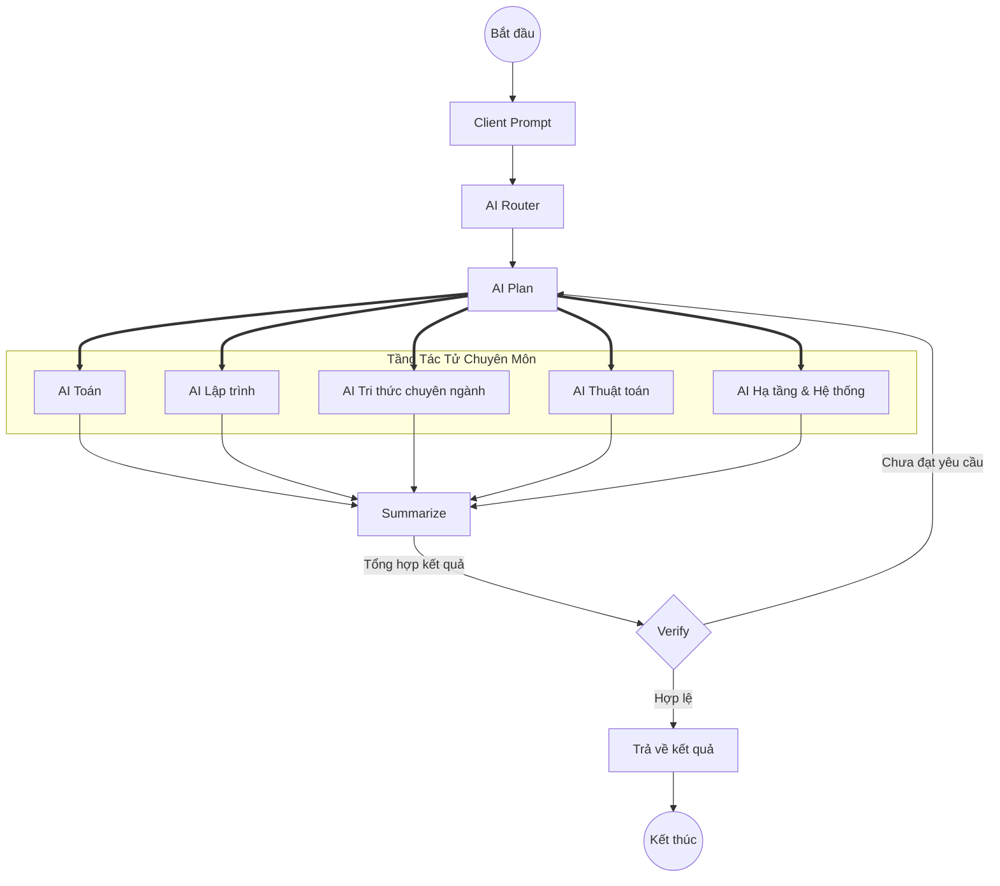

# UTH Data Science Agentic AI System

Hệ thống Agentic AI và Graph-RAG phục vụ cố vấn học tập, tra cứu tri thức và hỗ trợ sinh viên ngành Khoa học Dữ liệu tại Trường Đại học Giao thông Vận tải TP. Hồ Chí Minh (UTH).

---

## 1. Giới thiệu tổng quan

Hệ thống được thiết kế theo kiến trúc đa tác tử (Multi-Agent System), kết hợp giữa cơ chế định tuyến tác vụ (Task Routing), truy xuất tăng cường lai (Hybrid Retrieval Augmented Generation - RAG) và đồ thị tri thức (Knowledge Graph) nhằm cung cấp giải pháp tra cứu, phân tích và định hướng lộ trình học tập chuyên sâu cho sinh viên.

### Các tầng dữ liệu tri thức trong hệ thống:
* **Tầng 1 (Tổng quan & Khung CTĐT)**: Mục tiêu chương trình đào tạo (PO), Chuẩn đầu ra (PLO) và ma trận ánh xạ VQF.
* **Tầng 2 (Đề cương chi tiết học phần - ĐCCT)**: Chuẩn đầu ra môn học (CLO), ma trận đóng góp môn học, phương pháp đánh giá (Rubric) và kế hoạch giảng dạy chi tiết theo tuần.
* **Tầng 3 (Giáo trình & Học liệu chuyên sâu)**: Tài liệu tham khảo, bài giảng lý thuyết và bài tập thực hành.

---

## 2. Kiến trúc Hệ thống (Agentic Workflow)

Hệ thống hoạt động theo mô hình điều phối phân tầng với cơ chế kiểm chứng (Verification) trước khi phản hồi người dùng:



---

## 3. Cấu trúc Dự án

```plaintext
uth-ds-agentic-ai/
├── 0-PROJECT-OVERVIEW.md            # Tài liệu tổng quan kiến trúc và luồng điều phối
├── 1-SCHEMA-DESIGNING.md            # Đặc tả thiết kế Schema MongoDB và Cypher Graph Neo4j
├── docs/                            # Tài liệu chuyên sâu về Hybrid Search, BM25, Nomic, Qdrant
│   ├── 01_Kien_Truc_RAG_Hybrid_Search_Tong_Hop.md
│   ├── 02_BM25_Tong_Hop.md
│   ├── 03_Nomic_MoE_v2_Tong_Hop.md
│   ├── 04_RRF_Hybrid_Search_Tong_Hop.md
│   └── 05_Qdrant_Vector_DB_Tong_Hop.md
├── preprocessing_data/              # Pipeline bóc tách tài liệu PDF (MinerU / Magic-PDF)
│   ├── raw_pdfs/                    # Tập tin đề cương chi tiết học phần gốc (.pdf)
│   ├── scripts/parse_pdfs.py        # Kịch bản bóc tách đa tiến trình (Hỗ trợ Apple Silicon MPS)
│   ├── parsed_output/               # Dữ liệu trích xuất cấu trúc (Markdown, JSON, Images)
│   └── README.md                    # Hướng dẫn chi tiết cho module tiền xử lý
├── hybrid_search_demo/              # Demo kiểm thử tìm kiếm lai Dense + Sparse Vectors
├── fine-tune-nomic/                 # Module huấn luyện tối ưu mô hình Embedding
└── output/                          # Dữ liệu tri thức đã được trích xuất sẵn
```

---

## 4. Hướng dẫn Khởi chạy

### 4.1. Thiết lập Môi trường
```bash
# Khởi tạo và kích hoạt môi trường ảo
python3 -m venv .venv
source .venv/bin/activate

# Cài đặt các gói phụ thuộc
pip install -r hybrid_search_demo/requirements.txt
```

### 4.2. Tiền xử lý dữ liệu Đề cương học phần
```bash
# Chạy bóc tách tài liệu PDF bằng MinerU với đa tiến trình
.venv/bin/python preprocessing_data/scripts/parse_pdfs.py --all --workers 3
```

---

## 5. Danh mục Công nghệ (Technology Stack)

| Thành phần | Công nghệ / Giải pháp | Mô tả chức năng |
| :--- | :--- | :--- |
| **Ngôn ngữ** | Python 3.10+ | Ngôn ngữ phát triển toàn bộ pipeline và backend |
| **Document Parser** | MinerU (Magic-PDF), RapidTable, DocLayout-YOLO | Bóc tách cấu trúc tài liệu PDF sang Markdown và JSON |
| **Vector Database** | Qdrant | Lưu trữ và lập chỉ mục Dense Vector kết hợp Sparse Vector |
| **Embedding Model** | Nomic-Embed-Text (v2 MoE) | Mô hình nhúng văn bản đa ngôn ngữ phục vụ truy xuất ngữ nghĩa |
| **Keyword Retrieval** | BM25 (Sparse Vector) | Truy xuất chính xác theo từ khóa chuyên ngành |
| **Fusion Algorithm** | Reciprocal Rank Fusion (RRF) | Thuật toán hợp nhất xếp hạng giữa Dense và Sparse Search |
| **Knowledge Graph** | Neo4j | Quản lý quan hệ đa chiều giữa Môn học, CLO, PLO và Rubric |
| **Document Store** | MongoDB | Lưu trữ dữ liệu cấu trúc đề cương, chuẩn đầu ra và chunks |
