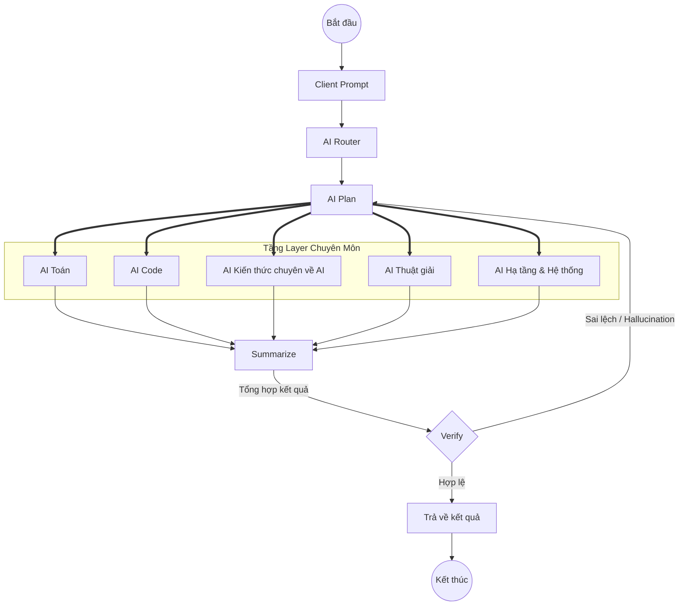

# 🤖 UTH Data Science Agentic AI (`uth-ds-agentic-ai`)

Hệ thống **Agentic AI & Knowledge Graph RAG** toàn diện hỗ trợ sinh viên ngành **Khoa học Dữ liệu (UTH - Trường Đại học Giao thông Vận tải TP.HCM)**.

---

## 🏛️ Kiến trúc Tổng thể (Agentic Workflow)



---

## 📂 Cấu trúc Repository

```plaintext
uth-ds-agentic-ai/
├── 0-PROJECT-OVERVIEW.md            # Tài liệu tổng quan kiến trúc Agentic AI
├── 1-SCHEMA-DESIGNING.md            # Thiết kế Schema MongoDB & Cypher Graph Neo4j
├── docs/                            # Tài liệu chuyên sâu về Hybrid Search, BM25, Nomic, Qdrant
├── preprocessing_data/              # Pipeline bóc tách PDF ĐCCT bằng MinerU (Magic-PDF)
│   ├── raw_pdfs/                    # 41 file PDF Đề cương học phần gốc
│   ├── scripts/parse_pdfs.py        # Script tự động parse đa tiến trình (MPS GPU)
│   └── parsed_output/               # Dữ liệu Markdown, JSON bóc tách
├── hybrid_search_demo/              # Demo tìm kiếm lai Dense + Sparse Vectors
├── fine-tune-nomic/                 # Module fine-tune mô hình Embedding
└── output/                          # Bộ dữ liệu tri thức đã được trích xuất
```

---

## 🚀 Bắt đầu Nhanh

### 1. Cài đặt môi trường
```bash
python3 -m venv .venv
source .venv/bin/activate
pip install -r hybrid_search_demo/requirements.txt
```

### 2. Tiền xử lý dữ liệu Đề cương học phần (MinerU Parser)
```bash
# Xem hướng dẫn chi tiết tại preprocessing_data/README.md
.venv/bin/python preprocessing_data/scripts/parse_pdfs.py --all --workers 3
```

---

## 🛠️ Công nghệ Lõi (Tech Stack)

* **Ngôn ngữ**: Python 3.10+
* **Document Parsing**: MinerU (Magic-PDF), PyMuPDF, RapidTable, DocLayout-YOLO
* **Vector Database**: Qdrant (Dense + Sparse Hybrid Search)
* **Embedding Model**: Nomic-Embed-Text (v2 MoE), Fine-tuned Nomic
* **Knowledge Graph**: Neo4j (GraphRAG cho Môn học - CLO - PLO - Rubric)
* **Document Storage**: MongoDB
