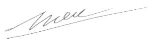

# TRƯỜNG ĐẠI HỌC GIAO THÔNG VẬN TẢI TP. HỒ CHÍ MINH ĐỀ CƯƠNG CHI TIẾT HỌC PHẦN (COURSE SYLLABUS)

## 1. Tổng quát về học phần (General course information)

<table><tr><td>Tên học phần</td><td colspan="3">Tiếng Việt: CẤU TRÚC RỜI RẠCTiếng Anh: DISCRETE STRUCTURES</td><td>Mã HP:122044</td></tr><tr><td>Số tín chỉ1</td><td colspan="4">4 (3,1,4)</td></tr><tr><td rowspan="2">Phân bổ thời gian</td><td>Lý thuyết/Bài tập/Dự án</td><td>Thực hành/Thí nghiệm/Thảo luận</td><td>Tổng</td><td>Tự học</td></tr><tr><td>45</td><td>30</td><td>75</td><td>125</td></tr><tr><td>Thang điểm</td><td colspan="4">10</td></tr><tr><td>HP học trước</td><td colspan="4">124001 - Kỹ thuật lập trình</td></tr><tr><td>HP song hành</td><td colspan="4"></td></tr><tr><td>Loại học phần</td><td colspan="4">☑ Bắt buộc □ Tự chọn bắt buộc □ Tự chọn tự do</td></tr><tr><td>Thuộc thành phần</td><td colspan="4"></td></tr></table>

## 2. Mô tả tóm tắt học phần (Course description)

Học phần Cấu trúc rời rạc là học phần bắt buộc nằm trong khối kiến thức cơ sở của nhóm ngành Công nghệ thông tin. Học phần này trang bị cho người học những kiến thức liên quan đến các đối tượng rời rạc trong toán học như logic mệnh đề; các phương pháp suy diễn, các phương pháp đếm; quan hệ tương đương, quan hệ thứ tự; đại số Bool và các khái niệm cơ bản về đồ thị, các loại đồ thị cùng với các thuật toán liên quan đến các bài toán trên đồ thị. Các kiến thức này hỗ trợ nhiều cho sinh viên tiếp thu các học phần cơ sở khác và chuyên ngành của mình như: Cơ sở dữ liệu, Phân tích thiết kế giải thuật, Hệ quản trị cơ sở dữ liệu, Mạng máy tính, Trí tuệ nhân tạo, Khai thác dữ liệu, Xử lý ảnh và thị giác máy tính, ...

## 3. Mục tiêu học phần (Course Objectives)

Học phần này trang bị cho sinh viên:

CO1. Áp dụng kiến thức cơ bản về cơ sở logic, phép đếm, quan hệ, đại số Bool và lý thuyết đồ thị để giải quyết các bài toán cơ bản thuộc nhóm ngành Công nghệ thông tin.

CO2. Liên hệ các kiến thức trong cấu trúc rời rạc để giải quyết các bài toán thực tế và cài đặt các thuật toán cơ bản của lý thuyết đồ thị.

CO3. Tự học tập, tích lũy và cập nhật kiến thức theo xu thế phát triển của lĩnh vực

4. Chuẩn đầu ra học phần (Course Learning Outcomes - CLO)

Sau khi học xong học phần này sinh viên có khả năng:

CLO1. Giải thích những khái niệm, thuật ngữ, và các vấn đề trọng tâm trong cấu trúc rời rạc; Tính toán và đếm các đối tượng trên các tập hợp rời rạc; Trình bày và áp dụng các thuật toán, các phương pháp liên quan để giải quyết các bài toán ở mức độ cơ bản.

CLO2. Thực hiện cài đặt các thuật toán cơ bản trong lý thuyết đồ thị.

CLO3. Diễn giải bài toán dựa trên cơ sở của cấu trúc rời rạc; Áp dụng các thuật toán, các phương pháp và nguyên lý trong cấu trúc rời rạc để giải các bài toán thực tế;

Liên hệ giữa CĐR học phần (CLOs) và CĐR CTĐT (PLOs):

<table><tr><td rowspan="2">PLO/CLO</td><td>PLO1</td><td colspan="4">PLO2</td><td colspan="3">PLO3</td><td>PLO4</td><td>PLO5</td><td colspan="3">PLO6</td><td colspan="2">PLO7</td></tr><tr><td></td><td>PI2.1</td><td>PI2.2</td><td>PI2.3</td><td>PI2.4</td><td>PI3.1</td><td>PI3.2</td><td>PI3.3</td><td></td><td></td><td>PI6.1</td><td>PI6.2</td><td>PI6.3</td><td>PI7.1</td><td>PI7.2</td></tr><tr><td>CLO1</td><td>I</td><td></td><td></td><td></td><td></td><td></td><td></td><td></td><td></td><td></td><td></td><td></td><td></td><td></td><td></td></tr><tr><td>CLO2</td><td></td><td></td><td>I</td><td></td><td></td><td></td><td></td><td></td><td></td><td></td><td></td><td></td><td></td><td></td><td></td></tr><tr><td>CLO3</td><td></td><td></td><td></td><td></td><td></td><td></td><td></td><td></td><td></td><td>I</td><td></td><td></td><td></td><td></td><td></td></tr></table>

Ghi chú: Điền vào bảng I/R/E vào các ô tương ứng. Học phần/Môn học này trong bảng ma trận họp phần đóng góp vào CĐR được người thiết kế CTĐT xác định ở mức I/R/E; tương ướng là phương pháp, nội dung dạy học và kiểm tra đánh giá phù hợp với mức độ đóng góp của học phần cho CĐR là mức I hoặc R hoặc E.

Lưu ý:

\- Khi thiết kết CLO sử dụng động từ ở thang đo Bloom cũng cần lựa chọn bậc phù hợp đối với vị trí của học phần trong ma trận đóng góp của học phần cho CĐR ở mức I, R hay E. Ví dụ, đối với học phần ở mức I thì có thể lựa chọn bậc 1, 2 hoặc 3.

\- Học phần có thể ở mức I đối với CĐR về kiến thức; nhưng ở mức R đối với CĐR về kỹ năng và ngược lại.

## 5. Nhiệm vụ của sinh viên (Students duties)

Sinh viên phải tham dự tối thiểu 80% số tiết của học phần;

Làm và nộp các bài tập/ báo cáo/ làm việc nhóm/ thuyết trình.... đúng thời gian quy định;

Tự nghiên cứu các vấn đề được giao ở nhà hoặc thư viện;

Hoàn thành các bài đánh giá quá trình; kết thúc học phần.

6. Phương pháp kiểm tra, đánh giá (Assessment methods):

Phương pháp kiểm tra đánh giá của HP đảm bảo người học đạt được CĐR mong đợi

<table><tr><td>Thành phần đánh giá[1]</td><td>Phương pháp/ Hình thức đánh giá[2]</td><td>CDR HP (CLOs)[3]</td><td>Tiêu chí đánh giá[4]</td><td>Trọng số(%) [5]</td></tr><tr><td rowspan="3">Đánh giá quá trình</td><td>Chuyên cần</td><td>CLO3</td><td>A1.1</td><td>10</td></tr><tr><td>Bài tập thực hành</td><td>CLO2, CLO3</td><td>A3.1</td><td>20</td></tr><tr><td>Kiểm tra giữa kỳ</td><td>CLO1, CLO2</td><td>A4.1</td><td>20</td></tr><tr><td>Đánh giá Kết thúc học phần</td><td>Bài tập lớn</td><td>CLO1, CLO2, CLO3</td><td>A5.4</td><td>50</td></tr><tr><td>Tổng cộng</td><td></td><td></td><td></td><td>100</td></tr></table>

## 7. Kế hoạch giảng dạy và học tập (Teaching and learning plan/outline)

<table><tr><td>Tuần /Chương[1]</td><td>Nội dung[2]</td><td>CDR(CLOs)[3]</td><td>Hoạt động dạyvà học[4]</td><td>Bài đánh giá[5]</td></tr><tr><td>1/1</td><td>Cơ sở logic1.5 Mệnh đề1.6 Các phép toán mệnh đề1.7 Biểu thức logic1.8 Các luật logicElearning: Bài tập của chương</td><td>CLO1</td><td>Giảng viên:- Giới thiệu thông tin về giảng viên, đề cương môn học, hình thức giảng dạy, phương pháp đánh giá.</td><td>A1.1A3.1A4.1</td></tr></table>

4

<table><tr><td>Tuần /Chương[1]</td><td>Nội dung[2]</td><td>CDR(CLOs)[3]</td><td>Hoạt động dạyvà học[4]</td><td>Bài đánh giá[5]</td></tr><tr><td></td><td></td><td></td><td>- Giảng cáckhái niệm cơbản mệnh đề,các phép toánmệnh đề, biểuthức và suyluận logic. Ví dụ minh hoạvà bài tập.Sinh viên:- Thảo luận vềnội dung bài giảng.- Làm các bài tập trên lớp.</td><td></td></tr><tr><td>2/1</td><td>Cơ sở logic (tiếp theo)1.9 Vị từ và lượng từ1.10 Các phương pháp suy diễn1.11 Nguyên lý quy nạpElearning: Bài tập của chương</td><td>CLO1</td><td>Giảng viên:- Giảng cáckhái niệm vềvị từ, lượng từvà trình bàycác phương pháp suy diễn. Ví dụminh hoạ vàbài tập.- Trình bày phương phápchứng minhquy nạp thôngqua ví dụ.Giảng vềnguyên lý quynạp và cácbước chứngminh một vấnđề bằng phương phápquy nạp.</td><td>A1.1A3.1A4.1</td></tr></table>

5

<table><tr><td>Tuần /Chương[1]</td><td>Nội dung[2]</td><td>CDR(CLOs)[3]</td><td>Hoạt động dạyvà học[4]</td><td>Bài đánh giá[5]</td></tr><tr><td></td><td></td><td></td><td>Sinh viên:- Thảo luận về nội dung bài giảng.- Làm các bài tập trên lớp.</td><td></td></tr><tr><td>3/2</td><td>Phương pháp đếm2.1 Tập hợp2.2 Ánh xạ2.3 Phương pháp đếmElearning: Bài tập của chương</td><td>CLO1</td><td>Giảng viên:- Trình bày khái niệm về tập hợp và các phép toán trên tập hợp. Ví dụ minh hoạ và bài tập.- Trình bày về các nguyên lý đếm. Ví dụ minh hoạ và bài tập.Sinh viên:- Thảo luận về nội dung bài giảng.- Làm các bài tập trên lớp.</td><td>A1.1A3.1A4.1</td></tr><tr><td>4/2</td><td>2.4 Phương pháp đếm (tiếp theo)2.4 Nguyên lý DirichletElearning: Bài tập của chương</td><td>CLO1</td><td>Giảng viên:- Trình bày khái niệm về chính hợp, chính hợp lặp, hoán vị, tổ hợp và tổ hợp lặp. Ví dụ minh hoạ và bài tập.- Trình bày về nguyên lý Dirichlet và</td><td>A1.1A3.1A4.1</td></tr></table>

6

<table><tr><td>Tuần /Chương[1]</td><td>Nội dung[2]</td><td>CDR(CLOs)[3]</td><td>Hoạt động dạyvà học[4]</td><td>Bài đánh giá[5]</td></tr><tr><td></td><td></td><td></td><td>dạng mở rộng. Ví dụ minh hoạ và bài tập.Sinh viên:- Thảo luận về nội dung bài giảng.- Làm các bài tập trên lớp.</td><td></td></tr><tr><td>5/3</td><td>Quan hệ3.1 Khái niệm và tính chất của quan hệ3.2 Quan hệ tương đươngElearning: Bài tập của chương</td><td>CLO1</td><td>Giảng viên:- Trình bày khái niệm về quan hệ và các tính chất cơ bản như phản xạ, đối xứng, phản xứng, bắt cầu.- Định nghĩa về quan hệ tương đương, sự phân hoạch một tập thành các lớp tương đương. Ví dụ minh hoạ và bài tập.Sinh viên:- Thảo luận về nội dung bài giảng.- Làm các bài tập trên lớp.</td><td>A1.1A3.1A4.1</td></tr><tr><td>6/3</td><td>Quan hệ (tiếp theo)3.3 Quan hệ thứ tựElearning: Bài tập củachương</td><td>CLO1</td><td>Giảng viên:- Trình bày khái niệm về quan hệ thứtự; cách biểu diễn một quan hệ thứ tự bằng biểu đồ Hasse. Định nghĩa về các phần tử tối tiểu, tối đại, cực tiểu, cực đại... Hướng dẫn sinh viên xác định các phần từ này từ biểu đồ Hasse. Ví dụ minh hoạ và bài tập.Sinh viên:- Thảo luận về nội dung bài giảng.- Làm các bài tập trên lớp.</td><td>A1.1A3.1A4.1</td></tr><tr><td>7/4</td><td>Đại số Bool4.1 Đại số Bool4.2 Hàm Bool4.3 Đa thức tối tiểu4.4 Phương pháp KarnaughElearning: Bài tập của chương</td><td>CLO1</td><td>Giảng viên:- Trình bày lý thuyết về đại số Bool và hàm Bool. Ví dụ minh hoạ và bài tập.- Trình bày khái niệm về đa thức tối tiểu và các phương pháp xác định công thức đa tối tiểu.- Trình bày phương pháp biểu đồKarnaugh để tìm công thức đa tối tiểu. Ví dụ minh hoạ và bài tập.Sinh viên:- Thảo luận về nội dung bài giảng.- Làm các bài tập trên lớp.</td><td>A1.1A3.1A4.1</td></tr><tr><td>8-9/5</td><td>Các khái niệm cơ bản về đồ thịBiểu diễn đồ thị trên máy tínhElearning: Bài tập của chương</td><td>CLO2CLO3</td><td>Giảng viên:- Giảng các khái niệm cơ bản về đồ thị và các dạng đồ thị đặc biệt.- Trình bày các phương pháp biểu diễn đồ thị trên máy tính sử dụng ma trận kê, ma trận trọng số, danh sách kê và danh sách cạnh.- Phân tích ưu khuyết điểm của từng phương pháp.Sinh viên:</td><td>A1.1A3.1A4.1</td></tr></table>

9

<table><tr><td>Tuần /Chương[1]</td><td>Nội dung[2]</td><td>CDR(CLOs)[3]</td><td>Hoạt động dạyvà học[4]</td><td>Bài đánh giá[5]</td></tr><tr><td></td><td></td><td></td><td>- Thảo luận về nội dung bài giảng.- Phân tích, so sánh, cho ví dụ về các dạng đồ thị đặc biệt.- Thảo luận về nội dung bài giảng.- Cải đặt các phương pháp biểu diễn đồ thị.</td><td></td></tr><tr><td>10/6</td><td>Tìm kiểm trên đồ thịĐồ thị Euler và đồ thịHamiltonElearning: Bài tập của chương</td><td>CLO2CLO3</td><td>Giảng viên:Sinh viên:- Thảo luận về nội dung bài giảng.- Phân tích, so sánh hai dạng đồ thị Euler và Hamilton.</td><td>A1.1A3.1A4.1</td></tr><tr><td>11/7</td><td>Cây và cây khung cực tiểu của đồ thịElearning: Bài tập của chương</td><td>CLO2CLO3</td><td>Giảng viên:- Trình bày các khái niệm cây, cây khung, cây khung cực tiểu của đồ thị.- Trình bày các giải thuật Kruskal, Prim để tìm cây khung cực tiểu trên một đồ thị chotrước. Ví dụvà bài tập.Sinh viên:- Thảo luận vềnội dung bàigiảng.- Phân tích vàso sánh 2thuật toán tîmcây khungcực tiểu.- Cải đặt thuậttoán Prim.- Cải đặt thuậttoán Kruskal.</td><td>A1.1A3.1A4.1</td></tr><tr><td>12-13/8</td><td>Bài toán tìm đường đi ngắnnhất và Luồng cực đại trênmạngElearning: Bài tập củachươngKiểm tra sơ bộ bài tập lớn</td><td>CLO2CLO3</td><td>Giảng viên:-Sinh viên:- Cải đặt cácgiải thuậtDijkstra,Ford-Bellmantrên máy tính.- Thảo luậnnhóm, phântích độ phứctạp và uukhuyết điểmcủa từng cấutừng giảithuật.- Phân tích,làm bài tập vídụ về giảithuật Ford-Fulkerson.Tìm hiểu cácví dụ ứng</td><td>A1.1A3.1A4.1</td></tr></table>

11

<table><tr><td>Tuần /Chương[1]</td><td>Nội dung[2]</td><td>CDR(CLOs)[3]</td><td>Hoạt động dạy và học[4]</td><td>Bài đánh giá[5]</td></tr><tr><td></td><td></td><td></td><td>dụng trong thực tiễn.</td><td></td></tr><tr><td>13/Bài tập lớn</td><td>Báo cáo bài tập lớn</td><td>CLO1CLO2CLO3</td><td></td><td>A5.2</td></tr></table>

8. Tài liệu học tập (Course materials)

## 8.1. Tài liệu chính (Main materials)

[1] Nguyễn Hữu Anh, 2005, Toán rời rạc, Nhà xuất bản Lao động xã hội

[2] Rosen, Kenneth H, 2019, Discrete Mathematics and its applications, McGraw-Hill

## 8.2. Tài liệu tham khảo (References materials)

[1] Ravichandran, V., & Razdan, A. K. (2025). Fundamental Discrete Structures. Springer.

[2] Levin, O. (2025). Discrete mathematics: An open introduction. CRC Press.

[3] Joseph Khoury, 2024, Tale of Discrete Mathematics: A Journey Through Logic, Reasoning, Structures and Graph Theory, World Scientific Publishing Company

[4] Các khái niệm cơ bản và các ví dụ đơn giản đi kèm trong Toán rời rạc https://www.geeksforgeeks.org/

[5] Biểu diễn trực quan các thuật toán trong lý thuyết đồ thị https://graphonline.ru/en/

9. Yêu cầu khác về học phần (Other course requirements and expectations) Không

10. Biên soạn và cập nhật đề cương (write and revise course syllabus)

\- Ngày biên soạn lần đầu: 01.09.2023

\- Ngày chỉnh sửa: 30.06.2024 (chỉnh sửa lần thứ 2).

PHÒNG ĐÀO TẠO

QL CHƯƠNG TRÌNH

GV LẬP ĐỀ CƯƠNG

TS. Lê Văn Quốc Anh

ThS. Bùi Trọng Hiếu

## PHỤ LỤC

## (Phụ lục của Đề cương chi tiết học phần)

## Phụ lục 1. Các Rubrics đánh giá

## Đánh giá chuyên cần

Rubric A1.1: Chuyên cần 1

<table><tr><td rowspan="2">Tiêu chí đánh giá</td><td colspan="5">Mức độ đạt chuẩn quy định</td><td rowspan="2">Trọng số</td></tr><tr><td>MỨC F(0-3.9)</td><td>MỨC D(4.0-5.4)</td><td>MỨC C(5.5-6.9)</td><td>MỨC B(7.0-8.4)</td><td>MỨC A(8.5-10)</td></tr><tr><td>Thái độ tham gia tích cực</td><td>Không tham gia các hoạt động</td><td>Ít tham gia các hoạt động</td><td>Có tham gia các hoạt động</td><td>Khá tích cực tham gia các hoạt động</td><td>Tích cực tham gia các hoạt động</td><td>50</td></tr><tr><td>Thời gian tham gia đầy đủ</td><td>Thời gian dưới 40%</td><td>Thời gian từ 40-54%</td><td>Thời gian từ 55-69%</td><td>Thời gian từ 70-84%</td><td>Thời gian từ 85% trở lên</td><td>50</td></tr></table>

Rubric A1.2: Chuyên cần 2

<table><tr><td rowspan="2">Tiêu chí đánh giá</td><td colspan="5">Mức độ đạt chuẩn quy định</td><td rowspan="2">Trọng số</td></tr><tr><td>MỨC F(0-3.9)</td><td>MỨC D(4.0-5.4)</td><td>MỨC C(5.5-6.9)</td><td>MỨC B(7.0-8.4)</td><td>MỨC A(8.5-10)</td></tr><tr><td>Thảo luận</td><td>Không tham gia đóng góp trong các hoạt động</td><td>Tham gia đóng góp ý kiến 01 lần</td><td>Tham gia đóng góp ý kiến 02 lần</td><td>Tham gia đóng góp ý kiến 03 lần</td><td>Tham gia đóng góp ý kiến trên 03 lần</td><td>50</td></tr><tr><td>Thời gian tham gia</td><td>Tham gia dưới 80% tổng buổi học được điểm danh (cấm thi)</td><td>Tham gia dưới 85% tổng buổi học được điểm danh</td><td>Tham gia dưới 70% tổng buổi học được điểm danh</td><td>Tham gia dưới 80% tổng buổi học được điểm danh</td><td>Tham gia không dưới 80% tổng buổi học được điểm danh</td><td>50</td></tr></table>

Lưu ý:  
Phần thảo luận: tổ chức tối thiểu 4 lần cho hoạt động như thực hiện bài tập tại lớp, bài tập tại nhà, hoạt động nhóm,...  
Cách thức tính thời gian tham gia thông qua điểm danh: có thể chọn ít nhất 1 trong các cách  
Điểm danh kèm kiểm tra thẻ sv tránh sv ngồi nhờ học hộ – điểm danh trực tiếp (ưu tiên)  
Điểm danh thông qua số lần nộp bài (bài kiểm tra cuối chương bài, bài ôn tập)  
Điểm danh thông qua số lần phát biểu, số lần tham gia một hoạt động cụ thể  
Dùng cho PI 7.1 và PI 7.2

Đánh giá bài tập trên lớp

Rubric A2.1: Bài tập trên lớp (kết hợp có đánh giá hoạt động, dùng cho môn không đánh giá chuyên cần riêng)

<table><tr><td rowspan="2">Tiêu chí đánh giá</td><td colspan="5">Mức độ đạt chuẩn quy định</td><td rowspan="2">Trọng số</td></tr><tr><td>MỨC F(0-3.9)</td><td>MỨC D(4.0-5.4)</td><td>MỨC C(5.5-6.9)</td><td>MỨC B(7.0-8.4)</td><td>MỨC A(8.5-10)</td></tr><tr><td>Chất lượng bài nộp</td><td>Thời gian dưới 40%</td><td>Thời gian từ 40-54%</td><td>Thời gian từ 55-69%</td><td>Thời gian từ 70-84%</td><td>Thời gian từ 85% trở lên</td><td>20</td></tr><tr><td>Thái độ tham gia</td><td>Không tham gia các hoạt động</td><td>Ít tham gia các hoạt động</td><td>Có tham gia các hoạt động</td><td>Khá tích cực tham gia các hoạt động</td><td>Tích cực tham gia các hoạt động</td><td>20</td></tr><tr><td>Kỹ năng thảo luận</td><td>Không thảo luận</td><td>Kém</td><td>Trung bình</td><td>Khá</td><td>Tốt</td><td>20</td></tr><tr><td>Chất lượng đóng góp ý kiến</td><td>Thời gian dưới 40%</td><td>Thời gian từ 40-54%</td><td>Thời gian từ 55-69%</td><td>Thời gian từ 70-84%</td><td>Thời gian từ 85% trở lên</td><td>40</td></tr></table>

Rubric A2.2: Bài tập trên lớp (không kết hợp có đánh giá hoạt động, dùng cho môn có phần đánh giá chuyên cần riêng biệt, và các môn có chữ A trong CTĐT, có thu thập minh chứng bài làm của người học)

<table><tr><td rowspan="2">Tiêu chí đánh giá</td><td colspan="5">Mức độ đạt chuẩn quy định</td><td rowspan="2">Trọng số</td></tr><tr><td>MỨC F(0-3.9)</td><td>MỨC D(4.0-5.4)</td><td>MỨC C(5.5-6.9)</td><td>MỨC B(7.0-8.4)</td><td>MỨC A(8.5-10)</td></tr><tr><td>Chất lượng bài nộp</td><td>Thời gian dưới 40%</td><td>Thời gian từ 40-54%</td><td>Thời gian từ 55-69%</td><td>Thời gian từ 70-84%</td><td>Thời gian từ 85% trở lên</td><td>100</td></tr></table>

## Đánh giá thực hành

Rubric A3.1: Bài tập thực hành (dùng cho các môn liên quan đến PLO5)

<table><tr><td rowspan="2">Tiêu chí đánh giá</td><td colspan="5">Mức độ đạt chuẩn quy định</td><td rowspan="2">Trọng số</td></tr><tr><td>MỨC F(0-3.9)</td><td>MỨC D(4.0-5.4)</td><td>MỨC C(5.5-6.9)</td><td>MỨC B(7.0-8.4)</td><td>MỨC A(8.5-10)</td></tr><tr><td>Thái độ tham dự tích cực</td><td>Không tham gia các hoạt động</td><td>Ít tham gia các hoạt động</td><td>Có tham gia các hoạt động</td><td>Khá tích cực tham gia các hoạt động</td><td>Tích cực tham gia các hoạt động</td><td>20</td></tr><tr><td>Kết quả thực hành</td><td>Không làm bài tập thực hành</td><td>Kết quả thực hành không đầy đủ, không đáp ứng yêu cầu</td><td>Tương đối đầy đủ và đáp ứng tương đối các yêu cầu, có một sai sót quan trọng.</td><td>Khá đầy đủ và đáp ứng khá tốt các yêu cầu, còn sai sót nhỏ</td><td>Đầy đủ và đáp ứng hoàn toàn các yêu cầu</td><td>40</td></tr><tr><td>Giải thích kết quả thực hành</td><td>Không làm bài tập thực hành</td><td>Giải thích không rõ ràng</td><td>Giải thích khá rõ ràng, còn nhiều sai sót quan trọng trong lập luận.</td><td>Giải thích khá rõ ràng, Còn một sai sót quan trọng trong lập luận.</td><td>Giải thích và lập luận rõ ràng</td><td>30</td></tr><tr><td>Báo cáo thực hành đúng quy định</td><td>Không làm bài tập thực hành</td><td>Chưa đầy đủ, chưa đúng hạn hoặc đúng định dạng</td><td>Chưa đầy đủ</td><td>Đầy đủ và đúng hạn.</td><td>Đầy đủ, đúng định dạng và đúng hạn.</td><td>10</td></tr></table>

## Đánh giá giữa kỳ/cuối kỳ

Rubric A4.1: Thi tự luận/Trắc nghiệm {bài thi giữa kỳ/bài thi cuối kỳ)

<table><tr><td rowspan="2">Tiêu chí đánh giá</td><td colspan="5">Mức độ đạt chuẩn quy định</td><td rowspan="2">Trọng số</td></tr><tr><td>MỨC F(0-3.9)</td><td>MỨC D(4.0-5.4)</td><td>MỨC C(5.5-6.9)</td><td>MỨC B(7.0-8.4)</td><td>MỨC A(8.5-10)</td></tr><tr><td>Chất lượng bài thi</td><td>Đúng dưới40%</td><td>Đúng từ 40-54%</td><td>Đúng từ 55-69%</td><td>Đúng từ 70-84%</td><td>Đúng từ 85% trở lên</td><td>100</td></tr></table>

Lưu ý: bài tập tại lớp hướng đến đạt bloom, bài thi cuối kỳ là phải có phần kiểm tra các câu đạt mức bloom theo quy định của đề cương.  
BTTL: lấy trung bình cộng các bài tập/ các bài kiểm tra cuối chương.  
Bài thi giữa kỳ: 2 cách thực hiện

\- Câu hỏi không cần đạt mức bloom, như BTTL (không dùng để đánh giá đạt bloom), cuối kỳ bộ đề phủ toàn bộ các chương.

\- Câu hỏi đạt mức bloom, giới hạn phạm vi chương, cuối kỳ thực hiện trong các chương còn lại, cả giữa kỳ và cuối kỳ đề được lấy để đo lường mức độ bloom.

## Đánh giá tiểu luận/đồ án/bài tập lớn

Rubric A5.1 Đánh giá Tiểu luận/ Đồ án/ Bài tập lớn: <50% tổng điểm môn (dùng cho các môn I hoặc R khi người học đạt ở cấp độ học để cải thiện thêm năng lực/ hoặc làm theo cá nhân/ giảng viên đánh giá người học), chủ yếu cho người học làm quen với việc tự học, thực hiện công việc theo quy định bloom cấp độ 3 trở xuống.

<table><tr><td rowspan="2">Tiêu chí đánh giá</td><td colspan="5">Mức độ đạt chuẩn quy định</td><td rowspan="2">Trọng số</td></tr><tr><td>MỨC 1(0-3.9)</td><td>MỨC 2(4.0-5.4)</td><td>MỨC 3(5.5-6.9)</td><td>MỨC 4(7.0-8.4)</td><td>MỨC 5(8.5-10)</td></tr><tr><td colspan="6">Chất lượng nội dung bài nộp</td><td>40%</td></tr><tr><td>Lỗi thuật ngữ</td><td>Tối thiểu 5 lỗi</td><td>Tối đa 4 lỗi</td><td>Tối đa 3 lỗi</td><td>Tối đa 2 lỗi</td><td>Tối đa 1 lỗi</td><td>10%</td></tr><tr><td>Lập luận</td><td>Không chặt chẽ, không logic</td><td colspan="2">Tương đối chặt chẽ, logic, có sai sót quan trọng</td><td>Khá chặt chẽ, logic; còn sai sót nhỏ</td><td>Hoàn toàn chặt chẽ, logic</td><td>30%</td></tr><tr><td colspan="6">Chất lượng hình thức bài nộp</td><td>30%</td></tr><tr><td>Format file theo định dạng: số trang tối đa, cách đều lẻ trái, phải, trên, dưới, font chữ, cỡ chữ</td><td>Không đúng yêu cầu</td><td>-</td><td>-</td><td>-</td><td>Đúng tất cả yêu cầu</td><td>30%</td></tr><tr><td colspan="6">Thuyết trình</td><td>30%</td></tr><tr><td>Có giao tiếp mắt, giọng rõ, trình bày và trả lời câu hỏi của sv khác trôi chảy, hình ảnh rõ ràng</td><td>Đúng tối đa 1 tiêu chí</td><td>Đúng 2 tiêu chí</td><td>Đúng 3 tiêu chí</td><td>Đúng 4 tiêu chí</td><td>Đúng tất cả tiêu chí đánh giá</td><td>30%</td></tr><tr><td>và phù hợp đề tài, thời gian</td><td></td><td></td><td></td><td></td><td></td><td></td></tr></table>

Rubric A5.2 Đánh giá Tiểu luận/ Đồ án/ Bài tập lớn: =50% tổng điểm môn (dùng cho các môn I hoặc R khi người học đạt ở cấp độ học để cải thiện thêm năng lực/ hoặc làm theo nhóm/ giảng viên đánh giá người học), chủ yếu cho người học làm quen với đề xuất hoạt động nhóm.

<table><tr><td rowspan="2">Tiêu chí đánh giá</td><td colspan="5">Mức độ đạt chuẩn quy định</td><td rowspan="2">Trọng số</td></tr><tr><td>MỨC 1(0-3.9)</td><td>MỨC 2(4.0-5.4)</td><td>MỨC 3(5.5-6.9)</td><td>MỨC 4(7.0-8.4)</td><td>MỨC 5(8.5-10)</td></tr><tr><td>Nội dung quy trình hoạt động nhóm do sinh viên đề xuất</td><td>Không đảm bảo tiêu chí nào trong quy định: chủ động và công bằng</td><td colspan="2">Đảm bảo một trong hai tiêu chí công bằng hoặc chủ động</td><td>Đảm bảo cả hai tiêu chí xây dựng nhóm.</td><td>Đảm bảo cả hai tiêu chí xây dựng nhóm và hoàn thành tối thiểu 85% công việc nhóm được giao.</td><td>20%</td></tr><tr><td>Sự phối hợp trong nhóm theo nội dung quy định nhóm đề xuất</td><td>Không thể hiện sự phối hợp.</td><td colspan="2">Nhóm phối hợp chưa tốt</td><td>Nhóm phối hợp khá tốt.</td><td>Nhóm phối hợp tốt.</td><td>20%</td></tr><tr><td>Chất lượng sản phẩm giao nộp và báo cáo.</td><td>Hoàn thành từ 39% bài tập trở xuống</td><td>Hoàn thành từ 40-54% bài tập</td><td>Hoàn thành từ 55-69% bài tập</td><td>Hoàn thành từ 70-84% bài tập</td><td>Hoàn thành từ 85% bài tập trở lên</td><td>60%</td></tr></table>

Rubric A5.3 Đánh giá Tiểu luận/ Đồ án/ Bài tập lớn: <50% tổng điểm môn (dùng cho các môn R khi người học đạt ở cấp độ học để cải thiện thêm năng lực, gv đánh giá người học, người học đánh giá người học theo phương pháp giáo dục khai phóng, các môn có PI yêu cầu sv đề xuất quy trình hoạt động nhóm)

<table><tr><td rowspan="2">Tiêu chí đánh giá</td><td colspan="5">Mức độ đạt chuẩn quy định</td><td rowspan="2">Trọng số</td></tr><tr><td>MỨC 1(0-3.9)</td><td>MỨC 2(4.0-5.4)</td><td>MỨC 3(5.5-6.9)</td><td>MỨC 4(7.0-8.4)</td><td>MỨC 5(8.5-10)</td></tr><tr><td>Chất lượng quy trình hoạt động đề xuất</td><td>Không nộp theo yêu cầu</td><td>Mô tả quy trình đáp ứng các yêu cầu cơ bản</td><td>Mô tả quy trình rõ ràng, thiếu nội dung quy định.</td><td>Mô tả quy trình rõ ràng, đầy đủ, tuy nhiên tính logic không đảm bảo toàn vẹn trong quy trình.</td><td>Mô tả quy trình đầy đủ các phần: phân công công việc, quản lý và kiểm soát, giải quyết và ra quyết định, thu thập và xử lý thông tin, phối hợp tăng cường sự tham gia và camkết, đảm phán và giải quyết xung đột.Quy trình mang tính logic cao.</td><td>30%</td></tr><tr><td>Chất lượng bài nộp</td><td>Hoàn thành từ 39% bài tập trở xuống</td><td>Hoàn thành từ 40-55% bài tập</td><td>Hoàn thành từ 55-69% bài tập</td><td>Hoàn thành từ 70-84% bài tập</td><td>Hoàn thành từ 85% bài tập trở lên</td><td>50%</td></tr><tr><td>Đánh giá chất lượng bài nộp của nhóm khác</td><td>Đánh giá không tuân thủ theo tiêu chí của nhóm</td><td>Đánh giá theo tiêu chí của nhóm, nhưng chất lượng tiêu chí ít.</td><td>Đánh giá theo tiêu chí của nhóm, nhưng chất lượng tiêu chí ở mức tương đối.</td><td>Đánh giá theo tiêu chí của nhóm, nhưng chất lượng tiêu chí ở mức tương đối.</td><td>Đánh giá theo tiêu chí nhóm, chất lượng đánh giá thể hiện nguyên tắc pháp lý, trách nhiệm nghề nghiệp.</td><td>20%</td></tr></table>

Rubric A5.4 Đánh giá bài nộp báo cáo Tiểu luận/ Đồ án/ Bài tập lớn: >=50% tổng điểm môn (dùng cho các môn M, M/A,R/A khi người học đạt ở cấp độ thành thạo)

<table><tr><td colspan="2">Tiêu chí</td><td>Tốt100%</td><td>Khá75%</td><td>Trung bình50%</td><td>Kém0%</td><td>Trọng số (%)</td></tr><tr><td colspan="2">Sản phẩm</td><td></td><td></td><td></td><td></td><td></td></tr><tr><td colspan="2">Hình thức trình bày</td><td>Thể thức văn bản nhất quán, không lỗi chính tả</td><td>Vài sai sót nhỏ về thể thức, ít lỗi chính tả</td><td>Vài chỗ không nhất quán về thể thức, nhiều lỗi chính tả</td><td>Thể hiện sự cấu thả về thể thức, lỗi chính tả nhiều</td><td>10</td></tr><tr><td colspan="2">Cấu trúc</td><td>Cân đối hợp lý</td><td>Khá cân đối, hợp lý</td><td>Tương đối cân đối, hợp lý</td><td>Không cân đối, thiếu hợp lý</td><td>10</td></tr><tr><td rowspan="3">Nội dung</td><td>Các thành phần nội dung</td><td colspan="4">Ghi thang điểm cụ thể cho từng phần nội dung tùy thuộc yêu cầu cụ thể của từng môn</td><td>40</td></tr><tr><td>Lập luận</td><td>Hoàn toàn chặt chẽ, logic</td><td>Khá chặt chẽ, logic; còn sai sót nhỏ</td><td>Tương đối chặt chẽ, logic, có sai sót quan trọng</td><td>Không chặt chẽ, không logic</td><td>20</td></tr><tr><td>Kết luận</td><td>Phù hợp</td><td>Khá phù hợp</td><td>Tương đối phù hợp</td><td>Không phù hợp, thiết sót</td><td>20</td></tr></table>

Rubric A5.5: Đánh giá Thuyết trình và bảo vệ quan điểm (theo nhóm) – oral presentation, slide thuyết trình

<table><tr><td>Tiêu chí</td><td>Tốt100%</td><td>Khá75%</td><td>Trung bình50%</td><td>Kém0%</td><td>Trọng số(%)</td></tr><tr><td>Nội dung</td><td>Phong chú</td><td>Đầy đủ theo yêu</td><td>Khá đầy đủ, còn thiếu 1</td><td>Thiếu nhiều nội dung</td><td>10</td></tr><tr><td rowspan="2"></td><td>hơn yêu cầu</td><td>cầu</td><td>nội dung quan trọng</td><td>quan trọng</td><td></td></tr><tr><td>Chính xác khoa học</td><td>Khá chính xác khoa học, còn và sai sót nhỏ</td><td>Tương đối chính xác, khoa học, còn 1 sai sót quan trọng.</td><td>Thiếu chính xác, khoa học, nhiều sai sót quan trọng.</td><td>20</td></tr><tr><td rowspan="2">Cấu trúc và tính trực quan</td><td>Cấu trúc bài và slide rất hợp lý</td><td>Cấu trúc bài và slide khá hợp lý</td><td>Cấu trúc bài và slide tương đối hợp lý</td><td>Cấu trúc bài và slide chưa hợp lý</td><td>10</td></tr><tr><td>Rất trực quan và thẩm mỹ</td><td>Khá trực quan và thẩm mỹ</td><td>Tương đối trực quan và thẩm mỹ</td><td>Ít/không trực quan và thẩm mỹ</td><td>10</td></tr><tr><td>Kỹ năng trình bày</td><td>Dẫn đất vấn đề và lập luận lôi cuốn, thuyết phục</td><td>Trình bày rõ ràng nhưng chưa lôi cuốn, lập luận khá thuyết phục</td><td>Khó theo dõi nhưng vẫn có thể hiểu được các nội dung quan trọng.</td><td>Trình bày không rõ ràng, người nghe không hiểu được các nội dung quan trọng.</td><td>10</td></tr><tr><td>Tương tác với người nghe</td><td>Nhóm tương tác tốt, bao quát.</td><td>Nhóm tương tác khá tốt, khá bao quát</td><td>Nhóm có tương tác nhưng chưa bao quát.</td><td>Nhóm không có tương tác/ rất ít.</td><td>10</td></tr><tr><td>Quản lý thời gian</td><td>Làm chủ thời gian và hoàn toàn linh hoạt điều chỉnh theo tỉnh huống.</td><td>Hoàn thành đúng thời gian, thỉnh thoảng có linh hoạt theo tỉnh huống</td><td>Hoàn thành đúng thời gian không linh hoạt theo tỉnh huống.</td><td>Quá giờ</td><td>10</td></tr><tr><td>Trả lời câu hỏi</td><td>Các câu hỏi đặt đúng đều được nhóm thảo luận và trả lời đầy đủ, rõ ràng và thỏa đáng</td><td>Trả lời đúng đa số câu hỏi đúng, và nêu được định hướng phù hợp đối với những câu hỏi chưa trả lời được.</td><td>Trả lời đúng đa số câu hỏi, nhưng chưa nêu được định hướng phù hợp đối với những câu hỏi chưa trả lời được.</td><td>Không trả lời được đa số câu hỏi đặt đúng.</td><td>10</td></tr><tr><td>Sự phối hợp trong nhóm (nếu có)</td><td>Nhóm phối hợp thực sự chia sẻ và hỗ trợ nhau trong khi báo cáo và trả lời.</td><td>Nhóm có phối hợp khi báo cáo và trả lời nhưng có và chỗ chưa đồng bộ.</td><td>Nhóm ít phối hợp trong khi báo cáo và trả lời.</td><td>Không thể hiện sự kết nối trong nhóm.</td><td>10</td></tr></table>

## Đánh giá hoạt động nhóm chi tiết

Rubric A6.1: Đánh giá Cá nhân trong làm việc nhóm, dùng cho các môn có yêu cầu hoạt động nhóm trong CTĐT, thuộc nhóm A có minh chứng để đánh giá đạt PLO

<table><tr><td>Tiêu chí</td><td>Trọng số (%)</td><td>Tốt 100%</td><td>Khá 75%</td><td>Trung bình 50%</td><td>Kém 0%</td></tr><tr><td>Thời gian tham gia hợp nhóm đầy đủ</td><td>15</td><td colspan="4">Chia đều cho số lần hợp nhóm.</td></tr><tr><td>Thái độ tham gia</td><td>15</td><td>Kết nối tốt.</td><td>Kết nối khá tốt</td><td>Có kết nối nhưng đôi khi còn lơ là phải nhắc nhở</td><td>Không kết nối</td></tr><tr><td>Chất lượng đóng góp ý kiến</td><td>20</td><td>Sáng tạo/ rất hữu ích</td><td>Hữu ích</td><td>Tương đối hữu ích</td><td>Không hữu ích</td></tr><tr><td>Thời gian</td><td>20</td><td>Đúng hạn</td><td>Trễ ít, không</td><td>Trễ nhiều, có gây ảnh</td><td>Nộp trẻ/không nộp</td></tr></table>

19

<table><tr><td>Tiêu chí</td><td>Trọng số(%)</td><td>Tốt100%</td><td>Khá75%</td><td>Trung bình50%</td><td>Kém0%</td></tr><tr><td>giao nộp sản phẩm đúng hạn</td><td></td><td></td><td>gây ảnh hưởng</td><td>huống quan trọng nhưng đã khắc phục.</td><td>gây ảnh hưởng không thể khắc phục</td></tr><tr><td>Chất lượng sản phẩm giao nộp</td><td>30</td><td>Đáp ứng tốt/sáng tạo</td><td>Đáp ứng khá tốt yêu cầu</td><td>Đáp ứng một phần yêu cầu, còn sai sót quan trọng</td><td>Không sử dụng được.</td></tr></table>